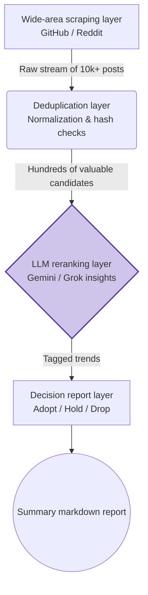

# 13. Algorithms & Data Pipelines Field Guide

> **Type**: Algorithmic thinking and practical exploration  
> **Focus**: Demystify foundational search and sort algorithms, then dissect the Hermit Purple funnel pipeline that powers the Moyin crawler.

---

## Prelude: What is an algorithm?
For developers who came through non-CS paths, “algorithms” can sound like jargon. At its core, an algorithm is simply a finite sequence of steps with well-defined input and output that solves a specific problem. Even though AI-assisted development often hides these steps behind libraries, grasping the terminology gives you a macro-level system view and trains you to prompt AI with surgical precision.

---

## 1. Search algorithms: locating needles in ocean-sized datasets
When your datastore grows to millions of rows, the efficiency of the search logic becomes the leading performance factor.

### Linear Search – the brute-force baseline
- **Operation**: Scan from the first element to the last, comparing each value in order.
- **Analogy**: Like leafing through an unsorted dictionary page by page until you find the word.
- **Practical note**: This is the simplest implementation, but the worst-case complexity is O(N), so it becomes self-destructive as the dataset grows.

### Binary Search – the halving blade
- **Prerequisite**: The target array must already be sorted.
- **Operation**: Compare the target against the midpoint, discard the half that cannot contain the value, and repeat on the remaining segment.
- **Analogy**: The “ultimate password” game (1–100): guess 50, then cut the interval in half depending on the response.
- **Practical note**: With O(log N) convergence, this is the foundation of all balanced search trees such as B-Trees.

---

## 2. Sorting algorithms: reshaping chaos into order
Binary search only works on ordered data, so we need sorting algorithms to prepare the ground.

### Bubble Sort – the textbook warning
- **Operation**: Repeatedly compare adjacent elements and swap them if they are out of order. After many passes, the extreme values float to the ends like bubbles.
- **Practical note**: With O(N²) complexity, major modern stacks avoid it except for teaching purposes.

### Quick Sort – the modern workhorse
- **Operation**: Use divide-and-conquer. Pick a pivot, partition the array so smaller values go left, larger go right, and recursively repeat.
- **Practical note**: Its average O(N log N) performance powers the built-in `sort()` in languages like Python and JavaScript (or their hybrids such as Timsort).

---

## 3. Funnel pipeline and information refinement
“Funnel algorithms” are less about asymptotic analysis and more about practical data processing pipelines. Think of a funnel: the wide mouth ingests raw streams, each tier strips noise, and the narrow tip drops the highest-quality signal.

- **Flow**: Each stage is a specialized filter that removes duplicates, malformed entries, or low-value hits.
- **Analogy**: Panning for gold in a river—the wider top collects everything, and sluices downstream concentrate the precious flakes.

In Moyin, Hermit Purple exemplifies this discipline with a CLI macro that relentlessly extracts and refines AI-relevant intelligence.

---

## 4. Hermit Purple’s funnel topology
Hermit Purple is a CLI crawler named for the stand in *JoJo’s Bizarre Adventure* that writes distant information. It harvests bleeding-edge AI intelligence from GitHub, Reddit, and beyond.

Once `fetch-ai-info` runs:

1. **Scraping layer**: indiscriminately pull JSON/HTML from trending sections of open-source repositories.
2. **Filtering layer**: eliminate duplicates by comparing hash signatures and drop anything that fails the length or quality gate.
3. **AI adjudication layer**: route the survivors through the `I1 Gateway` to Gemini/Grok. Require a three-way verdict:
   - **Adopt**: ready for sprint planning because it unlocks value or architectural breakthroughs.
   - **Hold**: insufficient community momentum; continue monitoring the star count.
   - **Drop**: toy packages with zero product potential.
4. **Reporting layer**: package the “Adopt” signals into a concise Markdown briefing.

### Pro-level prompt example
“Please build a Python crawler that obeys the Hermit Purple funnel pipeline: Stage one collects widely, stage two applies regex-powered filters, stage three feeds the filtered payload to an LLM for RAG-style summarization. Each pipeline node must log to the observability stack.”

This structure keeps the crawler low-coupling, high-signal, and ready for enterprise use.
