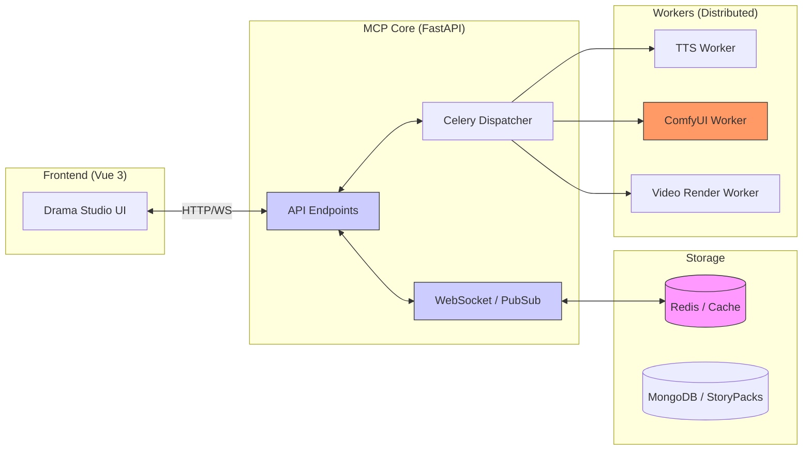

# 08. Moyin MCP Architecture

## MCP Server Architecture Diagram

`moyin-mcp-server` serves as the central dispatch hub, connecting the frontend UI with various backend rendering services.

## Communication Protocols

- **Command Channel**: Used for sending production commands (e.g., `start_render`).
- **Status Sync**: Real-time status synchronization based on Redis PubSub; the frontend UI listens for task progress.
- **Data Sync**: Uses `StoryPack` as the data exchange format between nodes.
