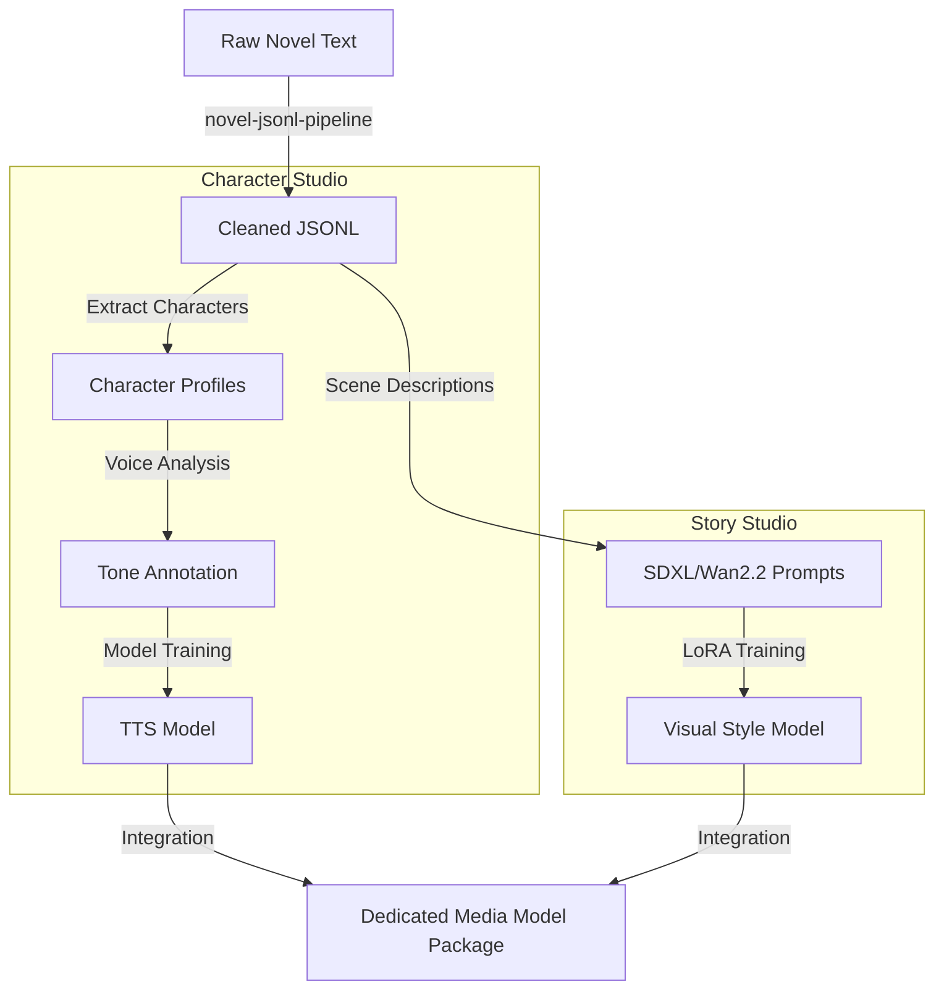

# 09. Model Studio Integration

## Model Training & Data Generation Pipeline

Illustrates how `moyin-model-studio` integrates the novel pipeline with character voice/visual training.

## Integration Goals

1.  **Low-Code Interface**: Rebuild the training pipeline using VueFlow (Vue 3).
2.  **Dataset Automation**: Automatically transform full-length novels into high-quality training datasets.
3.  **Cross-Model Alignment**: Ensure that a character's visual LoRA and TTS voice are tightly aligned during production.
