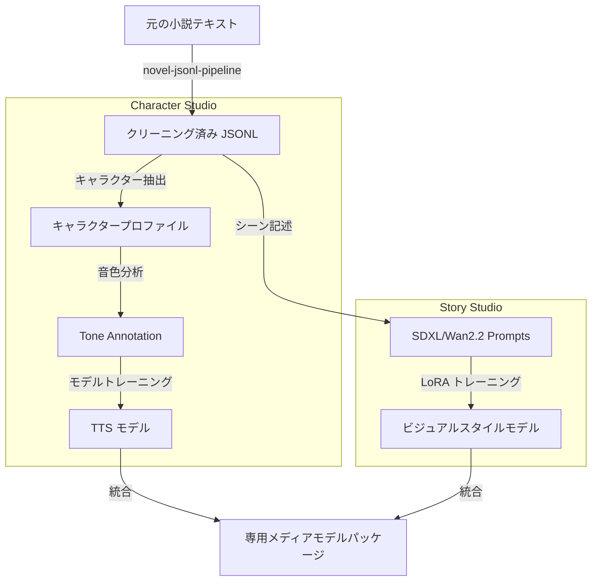

# 09. Model Studio 統合

## モデルトレーニングとデータ生成パイプライン（Pipeline）

`moyin-model-studio` が小説パイプラインとキャラクター音声 / ビジュアルトレーニングをどのように統合するかを示しています。

## 統合目標

1.  **ローコードインターフェース（Low-Code Interface）**: VueFlow (Vue 3) を使用してトレーニングパイプラインを再構築します。
2.  **データセット自動化（Dataset Automation）**: 長編小説を高品質なトレーニングデータセットに自動変換します。
3.  **クロスモデルアライメント（Cross-Model Alignment）**: 同一キャラクターのビジュアル LoRA と TTS 音色が制作時に高度に整合することを保証します。
