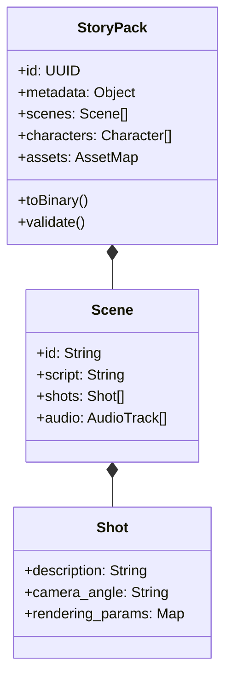

# 10. StoryPack データフロー（Data Flow）

## StoryPack 交換フォーマット標準

`StoryPack` は Moyin の全体で使用されるユニバーサルデータキャリア（Data Carrier）であり、創作からレンダリングまでの一貫性を保証します。

## データフロープロセス

1.  **作成フェーズ（Creation Phase）**: `moyin-web` が初期コンテンツを生成します。
2.  **拡充フェーズ（Enhancement Phase）**: `Director Agent` がストーリーボードとカメラの詳細を補強します。
3.  **配布フェーズ（Distribution Phase）**: `MCP Server` がパッケージを分割し、異なるワーカー（Worker）に配信します。
4.  **報告フェーズ（Reporting Phase）**: ワーカーが `StoryPack` 内の成果物パス（例：`video_url`）を更新します。
