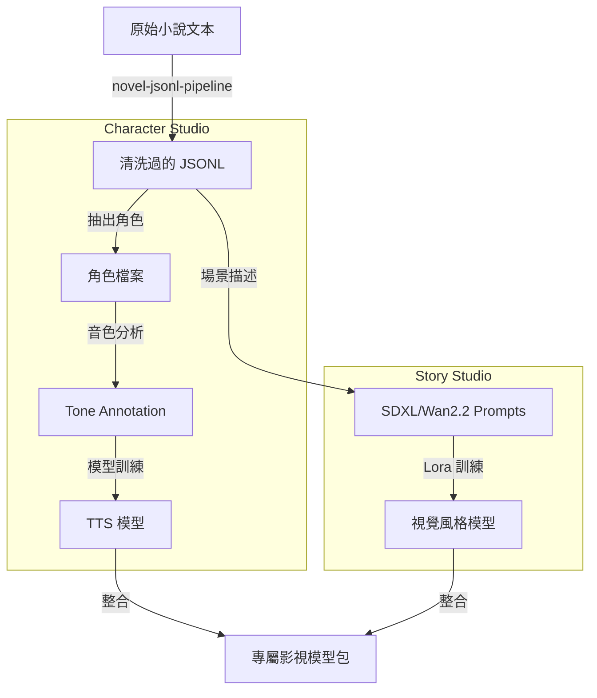

# 09. Model Studio Integration

## 🧠 模型訓練與數據生成流程

展示 `moyin-model-studio` 如何集成小說流水線與角色音色/形象訓練。

## 🎯 整合目標

1.  **Low-Code Interface**: 使用 VueFlow (Vue 3) 重構訓練流水線。
2.  **Dataset Automation**: 自動將長篇小說轉化為高質量的訓練數據集。
3.  **Cross-Model Alignment**: 確保同一角色的視覺 Lora 與 TTS 音色在生產時高度對齊。
