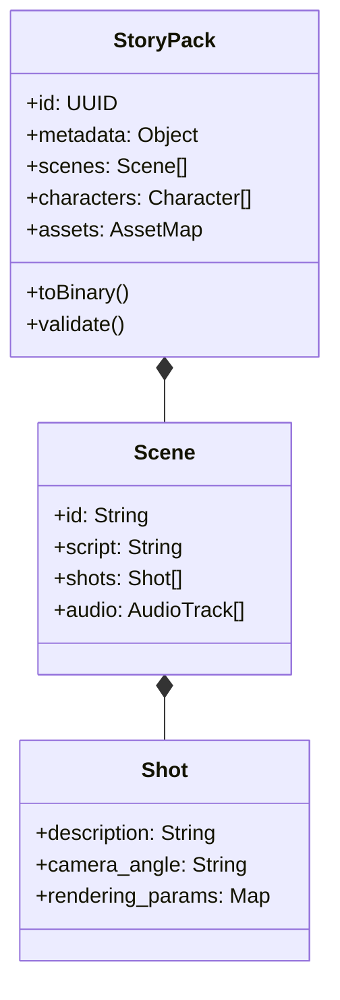

# 10. StoryPack Data Flow

## 📦 StoryPack 交換格式標準

`StoryPack` 是 Moyin 全局通用的數據載體，確保了從創作到渲染的一致性。

## 🔄 數據流轉流程

1.  **Creation Phase**: `moyin-web` 生成初始內容。
2.  **Enhancement Phase**: `Director Agent` 豐富分鏡與鏡頭細節。
3.  **Distribution Phase**: `MCP Server` 拆分打包發送給不同的 Worker。
4.  **Reporting Phase**: Worker 更新 `StoryPack` 中的產出物路徑（如 `video_url`）。
