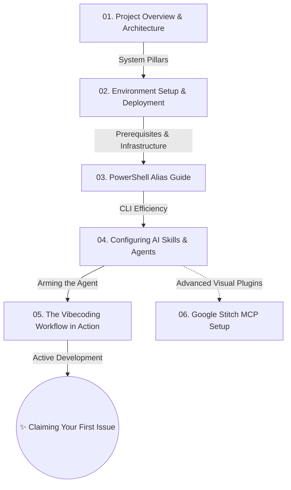

# Moyin Onboarding Guide: The Path to Vibecoding (Onboarding Guide)

## @Overview

Welcome to the Moyin Project! This guide is designed to provide you with a high-level architectural view and the technical specifics required to contribute effectively. We will move through system pillars, terminal-level configurations, and the core philosophies of **Vibecoding** (AI-native development). Your goal is to establish a seamless, high-velocity development rhythm where human decision-making and AI execution create a perfect synergy.

---

## 🗺️ Learning Map

To maximize efficiency and avoid cognitive overload, we recommend following the onboarding chapters in the sequence illustrated below:

---

## 📂 Core Curriculum

### Phase 1: Foundations & Infrastructure (Getting Started)

In this phase, our focus is singular: transforming your local environment into an AI-ready combat zone where autonomous agents can seamlessly take control of standard tasks.

1.  **[01. Project Overview & Architecture](./01_welcome_to_moyin.md)**
    - Understand the system boundaries—Frontend, Gateway, and AI compute—and the critical role of the Knowledge Base as the project's external "Brain."
2.  **[02. Environment Setup & Deployment](./02_environment_setup.md)**
    - Build your foundation. Install high-performance runtimes including `Node.js`, `Python`, `pnpm`, and `uv`.
3.  **[03. PowerShell Alias & Efficiency Guide](./03_powershell_alias_cheat_sheet.md)**
    - Ruthlessly eliminate repetitive typing. Use Aliases to collapse long, fragile command strings into single-stroke shortcuts.
4.  **[04. Configuring AI Skills & Agents](./04_skills_and_agents.md)**
    - Deconstruct the `.agent` directory. Learn to arm your AI with specialized "Skill Kits" and plug into the world via the "Universal MCP Socket."
5.  **[05. Mastering the Vibecoding Workflow](./05_vibecoding_workflow.md)**
    - **The absolute core of this guide.** Learn how to use natural language as an engineering tool, enforce the "Sentinel Protocols," and master the Slash workflows.
6.  **[06. Google Stitch MCP Setup (Optional)](./06_stitch_mcp_setup.md)**
    - Advanced elective. Learn how to integrate futuristic visual reasoning tools that allow AI to synthesize code directly from screenshots.

---

## 💡 Lead Architect's Summary: The First Mission

Once you have mastered these six fundamental chapters, you are officially qualified as a "Moyin Project AI Navigator."

You no longer need to spend your energy on manual labor. Instead, use your strategic oversight, rely on our version control safety nets, and confidently delegate your first engineering task to your AI counterpart. The era of manual coding is over; your journey as an architect begins here.

---

👉 **[Next Step: 01. Project Overview & Architecture](./01_welcome_to_moyin.md)**
