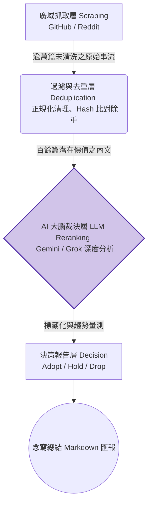

# 13. 資料結構基礎與 Hermit Purple 爬蟲漏斗管線 (Algorithms & Data Pipelines)

> **類型**: 演算法思維與專案實作探索  
> **重點**: 破除對演算法之刻板迷思，科普基礎搜尋排序思維，並深度解構 Moyin 專案中之 `Hermit Purple` (隱者之紫) 爬蟲工具所具備之「漏斗型過濾管線架構 (Funnel Pipeline)」。

---

## 前言：何謂演算法？

對從非本科系轉職的 Vibecoding 開發者而言，「演算法 (Algorithms)」似為數學象牙塔內之高深諱語。
實則不然，演算法之本質即為：**「旨在解決特定問題、具備明確輸入與輸出之標準化有限步驟」**。
在 AI 輔助開發的洪流中，雖多數實作已由底層函式庫包裝，然掌握演算法專業術語，能賦予開發者宏觀的系統視野，並寫出極度精準之指令驅使 AI 構築強健系統。

---

## 1. 搜尋演算法 (Search Algorithms)：於資訊汪洋中定址

當資料庫量級攀升至千萬筆別，系統找尋指定節點之邏輯效率便為效能之首決：

### 線性搜尋 (Linear Search) - 「暴力窮舉之始」

- **運作模式**：無腦自第一筆資料集開始巡覽比對，順序推進至陣列末端。
- **概念類比**：恍如在未編排目錄的字典中，從首頁開始一頁頁翻找指定詞彙。
- **工程評價**：撰寫邏輯最為低階。在最壞情況下 (Worst-case) 需耗費 O(N) 的時間複雜度，資料量暴漲時形同系統自殺。

### 二元搜尋 (Binary Search) - 「對半折疊之刃」

- **嚴苛前置**：目標資料庫必須為**「已排序 (Sorted)」**之狀態。
- **運作模式**：直接針對陣列中段節點下刀。若中位數大於搜尋目標，則果斷捨棄右半部之所有可能，繼續將左半徑實施對半切割，反之亦然。
- **概念類比**：電視節目常見之「終極密碼 (1~100)」。玩家首猜必定為 50，若嫌過大即猜 25。
- **工程評價**：具備 O(log N) 的狂暴收斂效能，為一切進階搜尋樹 (如 B-Tree) 之底層邏輯基石。

---

## 2. 排序演算法 (Sorting Algorithms)：資訊之梳理重構

以二元搜尋為例，為達成高效檢索之前提，我們必須仰賴演算法將混沌的資料陣列重塑為有序遞增之隊列。

### 氣泡排序 (Bubble Sort) - 「低效之教科書案例」

- **運作模式**：相鄰之兩筆元素反覆互相比對。若左大於右即對調位置。歷經數十輪之整列掃描後，極值會猶如水底氣泡般，緩緩被推擠至序列末端。
- **工程評價**：高達 O(N²) 的駭人複雜度，在現代工程實戰中早已遭全面棄用，僅作學理探討。

### 快速排序 (Quick Sort) - 「現代標配之實戰王者」

- **運作模式**：採取「分治法 (Divide and Conquer)」。於陣列中隨機標定一基準值 (Pivot / 隊長)。接著進行分流：小於隊長者盡數放逐左側，大於者盡留右側。隨後，左右兩陣營再度各自委任新隊長，無窮遞迴分化之。
- **實戰地位**：因具備 O(N log N) 之極優異均攤效能，當今主流程式語言 (如 Python/JS) 內建之 `sort()` 函數，其底層核心幾乎悉數以快速排序（抑或其變體如 Timsort）驅動。

---

## 3. 漏斗架構 (Funnel Pipeline) 與資訊精煉流

嚴謹而言，「漏斗演算法」並非計算機科學之固有結構，其更偏向於一門極為實用的**資料處理管線架構模式 (Data Processing Pipeline)**。多見於商業轉化率分析 (Conversion Rate) 與大數據清洗。

- **運作模式**：架構猶如沙漏，漏口極寬而底端細窄。每一水平斷層級距皆佈建一套特化之「篩檢器 (Filter)」。隨水流向下推移，雜質與離群值被無情剝離，最終滴落於匯集槽者，即為純度最高之關鍵變數。
- **戰術比喻**：於長江淘取純金。

於 Moyin 開發體系中，我們恰巧有一支將此過濾漏斗演繹至極致之輔助常駐程式：**Hermit Purple (隱者之紫)**。

---

## 4. 專案深潛：Hermit Purple (隱者之紫) 爬蟲決策大腦

**Hermit Purple** 為一具備純字元介面 (CLI) 之巨集資訊爬蟲。其命名致敬《JOJO 的奇妙冒險》中具備「念寫出遠端千里情報」之替身使者。它的核心使命，在替專案團隊於茫茫的 Github 與 Reddit 網海中，獵捕瞬息萬變的 AI 技術前沿。

### 【隱者之紫】的漏斗過濾管線拓撲

當指令碼 `fetch-ai-info` 放行後：

1. **頂部廣口層 (Scraping)**：無差別地從各大開源倉庫之 Trending 板塊攫取 JSON 與 HTML 原始節點。
2. **第一道截留閥 (Filter)**：將歷史已探勘之雜湊特徵 (Hash) 實施互斥比對，剔除重複與不滿字數閾值之劣質工單。
3. **AI 智慧裁決層 (Curate)**：漏斗之靈魂！程式將倖存之精華打包，經由 `I1 Gateway` 路由遞交予 Gemini/Grok 等大型語言模型進行閱讀理解。強制要求其吐出三個維度之決斷：
   - **Adopt (採用)**：具備變現價值或架構破局點，即刻排入 sprint。
   - **Hold (觀望/留校察看)**：社群維護聲量不足，持續監測星數 (Stars)。
   - **Drop (拋棄)**：經剖析為無商轉實力之玩具套件。
4. **輸出收斂層 (Report)**：剔除其餘無謂雜訊，最終將「Adopt」類之情資，凝練重組為具高度可讀性之 Markdown 戰情簡報。

### 🟢 給資深 Vibecoding 開發者之發包建議：

將此管線思維內化後，未來下達編撰資料分析或清理腳本之指令，您的 Prompt 將具備強大之系統化威力：

> 🗣️ `「懇請撰寫一套 Python 爬蟲服務。請務必遵循【Hermit Purple 之漏斗型架構設計 (Funnel Pipeline)】：`
> `階段一、無差別蒐集；階段二、動用正則表達式落實雜訊過濾 (Filter)；階段三、串接 LLM 檢索增強並提取核心摘要。且明令於管線之各個節點，皆須對接 Logging 服務以確保溯源無虞。」`

依此嚴謹的結構化約束，AI 將交付給您一支耦合度極低、擴充性極佳的工業級採集爬蟲。
