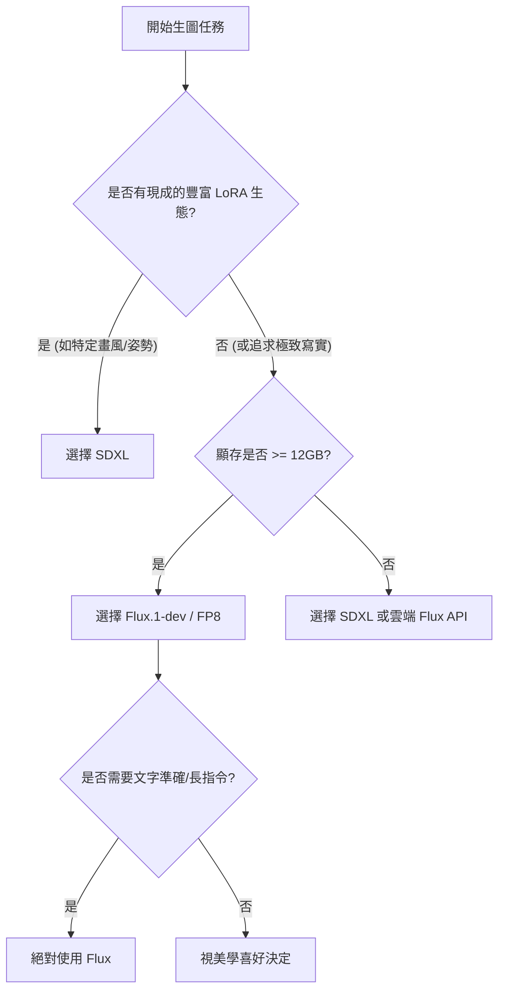

# 07.11 Flux 文生圖模型實戰 — 新世代擴散模型架構解析

> **類型**: 技術深潛 + 工程實戰
> **日期**: 2026-03-26
> **來源**: SDXL 到 Flux 的世代遷移實戰

---

## 摘要

Flux.1 是由 Black Forest Labs（原 Stable Diffusion 核心團隊成員組成）推出的開源權重模型，其出現標誌著開源影像生成領域正式從「U-Net 時代」跨入「DiT (Diffusion Transformer) 時代」。Flux 不僅在參數量上大幅超越了 SDXL（約 120 億參數），更透過引入 Flow Matching 技術與多模態 DiT 架構，徹底解決了過往擴散模型在文字渲染、人體結構（尤其是手指）以及複雜指令遵循（Prompt Following）上的痛點。

在 LoRA 訓練方面，Flux 展現了極強的表達能力。得益於其巨大的參數容量與更精確的潛在空間（Latent Space）表示，Flux LoRA 的收斂速度與細節補捉能力遠超 SDXL。即便在較低的 Rank 設定下，Flux 也能精準還原訓練集中的光影細節與特定風格，這使其成為當前企業級自定義影像生成方案的首選基礎模型。

> [!NOTE]
> 💡 **白話文解釋**：
> 如果說 SDXL 是那台需要你手動對焦、計算曝光補償，還要配備一堆濾鏡（Negative Prompts, ControlNet）才能拍出好照片的「老牌膠卷相機」，那麼 Flux 就是一台搭載了 AI 對焦、全片幅感光元件且能直出原片的「頂規無反相機」。你不必再苦思「Masterpiece, 8k, highly detailed」這種玄學咒語，只要對著這台相機說說人話，它就能給你一張連毛孔細節、甚至是內衣花紋都對得上的大片。最幽默的是，以前 SDXL 拍出的模特兒可能有六隻手指，現在 Flux 終於知道人類不是變種人了。

---

## 背景

自 2023 年 SDXL 發布以來，開源社群雖然發展出無數的微調模型，但其底層架構的侷限性也日益明顯：
1. **雙 CLIP 瓶頸**：SDXL 使用 CLIP ViT-L 與 OpenCLIP ViT-bigG 的組合，雖然提升了語義理解，但對於長文本（Long Prompt）的解析力依然薄弱，常出現詞序混亂的情況。
2. **固定比例訓練**：雖然可以透過 Bucketing 處理不同比例，但在非標準解析度下，容易出現構圖斷裂或肢體殘缺。
3. **訓練不穩定性**：SDXL 的 V-Prediction 或 Epsilon 預測在訓練 LoRA 時，對學習率極其敏感，容易導致模型崩壞或過擬合。

Flux 則是為了徹底打破這些框架而生，它不再試圖對 U-Net 縫縫補補，而是直接將 Transformer 架構引入擴散過程，並整合了 T5-XXL 這種強大的文本編碼器。

---

## 詳細內容

### 1. Flux 架構核心創新

Flux 的技術架構可以歸納為四大支柱：

*   **DiT (Diffusion Transformer)**：
    不同於傳統 SD 模型使用卷積神經網路（CNN）構成的 U-Net，Flux 採用了 Transformer 塊作為骨幹。這意味著模型可以更有效地處理長距離的像素依賴關係。Flux 引入了所謂的 **MM-DiT (Multimodal DiT)**，它將圖像特徵與文本特徵在同一層級進行融合，而不是像 SDXL 那樣僅透過 Cross-Attention 進行簡單掛載。
*   **Flow Matching (流匹配)**：
    這是 Flux 最核心的數學創新。傳統的 DDPM (Denoising Diffusion Probabilistic Models) 是模擬高斯雜訊的擴散過程，而 Flow Matching 則是學習將簡單分佈（雜訊）轉換為複雜分佈（圖像）的一條「直線」路徑。這種路徑比 DDPM 的「曲線」更易於學習與預測，使得模型在極少的步數下（如 Schnell 版本僅需 4 步）就能生成高品質影像。
*   **T5-XXL + CLIP-L 雙編碼器**：
    Flux 同時保留了 CLIP-L（用於基本的視覺概念識別）並加入了巨大的 T5-XXL 編碼器（用於邏輯與空間關係理解）。這讓 Flux 強大到可以理解「一個人在左邊喝咖啡，背景的黑板上用粉筆寫著：Hello Flux」這種複合型指令。
*   **原生多解析度支援 (PE)**：
    透過引進 2D 旋轉位置嵌入 (RoPE)，Flux 在推理時對解析度的寬容度極高，不再侷限於 1024x1024，能流暢處理超寬螢幕或極端縱向的構圖。

### 2. Flux 模型系列對比

Flux 根據應用場景分為三個主要版本：

| 維度 | Flux.1-schnell | Flux.1-dev | Flux.1-pro |
| :--- | :--- | :--- | :--- |
| **定位** | 蒸餾/極速版 (Fast) | 基礎開發/科研版 | 商業閉源版 (API) |
| **參數量** | 12B | 12B | 12B+ |
| **建議步數** | 1 - 4 步 | 20 - 50 步 | 30 - 50 步 |
| **授權方式** | Apache 2.0 (完全開源) | 非商業用途專利授權 | 商用付費 API |
| **品質** | 中高 (細節略有損失) | 極高 (最佳開源實力) | 最頂尖 |
| **適用場景** | 網頁實時生圖、快速測試 | LoRA 訓練、高品質創作 | 企業級應用服務 |

### 3. 在 ComfyUI 中使用 Flux

要在 ComfyUI 中完美驅動 Flux，核心節點與參數設定與 SDXL 有顯著差異：

*   **ModelSamplingFlux 節點**：這是 Flux 處理時間步（Timesteps）的核心。必須確保 `max_shift` 參數與 `base_shift` 參數正確（通常預設為 1.15 和 0.5），這會直接影響 Flow Matching 的推理路徑。
*   **Guidance (引導係數)**：這是一個新的關鍵參數。在 `CLIPTextEncodeFlux` 中，你會發現一個 `guidance` 選項。不同於 SDXL 的 CFG，Flux 在 `cfg=1.0` (完全停用 CFG) 的情況下表現最佳，轉而使用內部引導。對於 Dev 版本，建議將 `guidance` 設在 3.5 左右。
*   **步數設定**：
    *   **Schnell**: 必須使用專用的 `FluxGuidance` 值或直接在 `KSampler` 中將 cfg 設為 1.0，步數 4 步足矣，超過 8 步反而會出現偽影。
    *   **Dev**: 推薦 20-30 步，採樣器選擇 `euler` 或 `uni_pc`。

### 4. Flux LoRA 訓練特點

Flux 的 LoRA 訓練被公認為是「力大磚飛」的典型。由於基礎模型極強，即使是少量的訓練數據也能產生驚人效果。

*   **Rank (網路秩) 建議**：
    與 SDXL 習慣使用的 Rank=64 或 128 不同，由於 Flux 參數規模巨大，實驗證實 **Rank=16 或 32** 配合良好的 Alpha 設定（通常 Alpha=Rank）即可捕捉到絕大部分細節。過高的 Rank 反而容易導致 VRAM 溢出且提升不明顯。
*   **學習率調整**：
    推薦使用 `Prodigy` 或 `AdamW8bit` 優化器。學習率（Learning Rate）通常設在 `1e-4` 左右。
*   **訓練框架對比**：
    *   **sd-scripts (Kohya_ss)**：目前已支援，但配置較複雜，適合硬核玩家。
    *   **SimpleTuner**：目前 Flux 訓練效果最佳的框架，內建大量針對 Flux 最佳化的 Data Augmentation 方法。
*   **VRAM 需求對比**：

| 硬體設備 | 訓練模式 | VRAM 佔用 | 速度 (it/s) |
| :--- | :--- | :--- | :--- |
| RTX 3060 (12GB) | FP8 + Bf16 (量化) | ~11.5GB (極限) | 0.05 (極慢) |
| RTX 4080 (16GB) | FP8 重算 | ~14.5GB | 0.4 |
| RTX 4090 (24GB) | BF16 (非量化) | ~22GB | 1.2 |

### 5. 提示詞策略差異

Flux 的革命性進步在於它「聽得懂人話」。

*   **自然語言 vs 標籤堆砌**：
    在 SDXL 中，我們習慣寫 `1girl, solo, long hair, blue background, masterpiece, 8k`。
    在 Flux 中，你可以寫 `A high-resolution photograph of a solitary girl with long flowing hair, standing gracefully against a vibrant blue studio background.`
*   **負向提示詞 (Negative Prompt)**：
    **Flux 幾乎不需要負向提示詞**。在 ComfyUI 的 Flux 工作流中，負向節點通常是被旁路（Bypass）掉的。甚至有些實驗顯示，加入過多負向提示詞反而會干擾 DiT 的注意力分配，導致構圖崩壞。
*   **多國語言支援**：
    得益於 T5-XXL，Flux 對中文的理解能力有了質的飛躍。雖然核心訓練集仍以英文為主，但直接輸入「一個穿著旗袍的女人在繁華的台北夜市」也能得到 80% 以上的準確度。

### 6. 量化版本與 VRAM 優化

對於一般開發者，24GB VRAM 的門檻依然較高，因此量化技術至關重要：

*   **FP8 (Float8)**：目前最平衡的選擇。將模型權重從 32GB (FP32) 或 16GB (BF16) 壓縮到約 11B 大小。品質損耗幾乎不可察覺，是 12GB/16GB 顯卡玩家的救星。
*   **NF4 (Normal Float 4)**：一種極端的 4-bit 量化。雖然可以讓 8GB 顯卡跑動 Flux，但在細節（如皮膚紋理）上有明顯的模糊感，僅推薦作為初期構圖測試使用。
*   **Flash Attention 2**：在訓練與推理時務必啟用。這能有效降低 Transformer Block 的記憶體開銷，對長邊超過 1536px 的生成任務至關重要。

---

## SDXL vs Flux 決策指引

作為工程師，選擇工具應基於場景：

---

## 實際測試案例分析：虛構角色「星夜 (Starry Night)」

為了測試 Flux 的極限，我們定義了一個複雜角色：
*   **特徵**：深藍色長髮，瞳孔中有星光效果，穿著飾有維多利亞風格蕾絲的賽博龐克外套，背景為霓虹燈閃爍的街區。

### 提示詞 (Prompt)：
> "A cinematic portrait of a girl named Starry Night. She has extremely long dark blue hair that flows like water. Her eyes glow with a galaxy-like starry pattern inside. She is wearing a Victorian-style lace collar mixed with a high-tech metal cyberpunk jacket. The background is a blurred futuristic city street with neon signs. High contrast, sharp focus on eyes, 8k resolution."

### 對比評估：

| 評估指標 | SDXL (base + Refiner) | Flux.1-dev |
| :--- | :--- | :--- |
| **相似度 (Identity)** | 容易遺失「瞳孔星光」細節 | 完美呈現複合材質與瞳孔光效 |
| **細節度 (Detail)** | 蕾絲與金屬邊緣常出現混淆 | 蕾絲紋路與機甲邊界分明，質感極佳 |
| **一致性 (Consistency)** | 長髮常與背景霓虹燈融合在一起 | 頭髮邊緣處理乾淨，層次感分明 |
| **手部/結構** | 可能出現手指畸形 | 手指抓取外套邊緣的手勢極其自然 |

---

## 常見問題 (FAQ)

| 問題現象 | 可能原因 | 解決方法 |
| :--- | :--- | :--- |
| **生成畫面全是灰黑色雜訊** | VAE 未正確加載或模型權重損壞 | 下載獨立的 `ae.safetensors` 並正確連接節點 |
| **VRAM 溢出 (OOM)** | 加載了 FP16 權重，顯存不足 | 更換為 `FP8` 或 `GGUF` 量化版本模型 |
| **LoRA 效果非常微弱** | 權重 (Strength) 太低或未正確連接 | 在 Flux 中，LoRA 權重通常需設在 0.8-1.0，且必須使用 Flux 專用 LoRA |
| **生圖速度慢得離譜 (每秒 20s+)** | 觸發了系統記憶體 (Shared VRAM) 補償 | 使用 `--lowvram` 參數或更換 NF4 版本，並關閉顯卡驅動的記憶體備援功能 |

---

## 總結

Flux 的出現，代表著影像生成從過去那種「靠運氣抽卡、靠大量提示詞工程調參」的 trick-heavy 模式，正式轉向「直觀理解、真實物理反饋」的新世代。雖然其硬體門檻較 SDXL 提高了一個量級，但其帶來的生成品質與指令遵循能力是具有代差優勢的。

作為影像工程師，我們應當關注 Flux 在工作流中的深度整合，尤其是其 MM-DiT 架構在後續 ControlNet 訓練與影片生成（Video Generation）領域的潛力。圖像生成的下半場，已經在 Flow Matching 的直線路徑中拉開了序幕。
