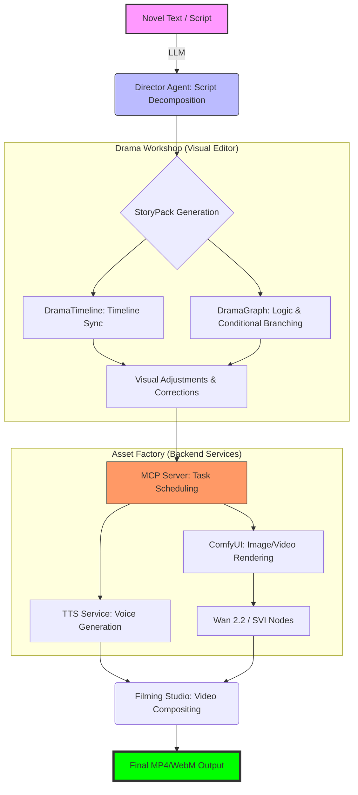

# 07. AI Drama Production Workflow: From Novel Text to MP4 (Drama Production Workflow)

## @Overview

Hello, I'm AKIRA.
Today we dissect the core of the Moyin project: the full picture of the "AI Drama Production Pipeline."

"Write the novel text, and AI handles the rest"—that's the world Moyin aims to create. But in reality, the inside of that "everything" runs a sophisticated multi-stage pipeline. Today we present the design blueprint from end to end.

---

## 🎭 Full Drama Production Flow

This flow shows the automated end-to-end path from novel text to the final video output.

```mermaid
graph TD
    A[Novel Text / Script] -->|LLM| B(Director Agent: Script Decomposition)
    B --> C{StoryPack Generation}

    subgraph "Drama Workshop (Visual Editor)"
        C --> D[DramaTimeline: Timeline Sync]
        C --> E[DramaGraph: Logic & Conditional Branching]
        D & E --> F[Visual Adjustments & Corrections]
    end

    F --> G[MCP Server: Task Scheduling]

    subgraph "Asset Factory (Backend Services)"
        G --> H[TTS Service: Voice Generation]
        G --> I[ComfyUI: Image/Video Rendering]
        I --> J[Wan 2.2 / SVI Nodes]
    end

    H & J --> K(Filming Studio: Video Compositing)
    K --> L[Final MP4/WebM Output]

    style A fill:#f9f,stroke:#333,stroke-width:2px
    style L fill:#00ff00,stroke:#333,stroke-width:4px
    style B fill:#bbf,stroke:#333
    style G fill:#f96,stroke:#333
```

---

## 🔍 Detailed Node Breakdown

### 📝 Origin: Novel Text / Script

Everything begins with natural-language text. Whether a full-length novel or a short screenplay, it serves as the input to the Director Agent.

### 🤖 Director Agent: Script Decomposition Engine

This agent, with an LLM (large language model) at its core, converts natural language narratives into structured `StoryPack` JSON format:

- Scene splitting and ordering
- Character identification and emotion labeling
- Camera angle and shot direction generation
- Conditional branching (choices) definition

### 🎬 Drama Workshop: Visual Editor Layer

A critical middle layer where humans can intervene in the pipeline:

**DramaTimeline (Timeline Sync)**

- Precise timecode synchronization of voice, BGM, and camera shots
- Frame-level fine adjustment

**DramaGraph (Non-linear Script Editor)**

- Node editor implemented with VueFlow (Vue 3-based)
- Visual editing of branching scenarios (IF/ELSE logic)
- Management of character conditional emotional changes

### ⚙️ MCP Server: Task Scheduler

After editing is complete, the MCP (Model Context Protocol) server acts as the orchestrator:

- Routes tasks to appropriate worker queues
- `default_queue`: CPU-intensive tasks (TTS, data transformation)
- `gpu_queue`: GPU-intensive tasks (ComfyUI rendering, video compositing)

### 🎨 Asset Factory: Backend Service Cluster

**TTS Service (Voice Generation)**

- Synthesizes character-specific voices with GPT-SoVITS
- Automatic volume, speed, and pitch adjustment based on emotion labels

**ComfyUI (Image/Video Rendering)**

- High-quality video generation using Wan 2.2 / SVI nodes
- LoRA model application to maintain character appearance consistency

### 🎞️ Filming Studio: Final Video Compositing

Synchronously composites audio tracks and video frames to output the final MP4/WebM file.

---

## 🛠 Key Technical Points Summary

| Component      | Technology        | Role                              |
| -------------- | ----------------- | --------------------------------- |
| Director Agent | LLM (Claude/GPT)  | Natural Language → StoryPack JSON |
| DramaTimeline  | Vue 3 + Tone.js   | Timecode sync editor              |
| DramaGraph     | VueFlow           | Non-linear scenario graph editor  |
| MCP Server     | FastAPI + Celery  | Task queue management             |
| TTS            | GPT-SoVITS        | Character voice synthesis         |
| Video Gen      | ComfyUI + Wan 2.2 | AI video rendering                |

---

## 💡 Why This Architecture?

**Why add a human-controllable midpoint (Drama Workshop)?** AI-generated scripts aren't perfect. Character emotions or camera work may differ from the vision. By inserting a visual editor layer, we achieve the optimal balance between "full automation" and "human creativity."

**Why separate the queues?** TTS is a CPU-dominated world; video generation is a GPU-dominated world. Mixing them in the same queue means GPU tasks endlessly wait for CPU tasks—or vice versa. Dedicated queues maximize throughput.

---

👉 **[Next: MCP Architecture Details](./08.Moyin_MCP_Architecture.md)**
