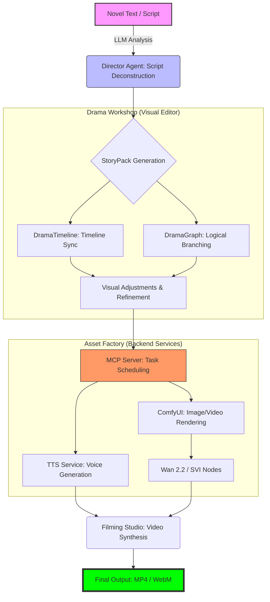

# AI Narrative Production Pipeline (Drama Production Workflow)

## @Overview

This workflow illustrates the end-to-end automated pathway from raw textual "Novels/Scripts" to final "Video Outputs," orchestrated through AI-driven agents and backend services.

---

## 🎭 Production Flowchart

```mermaid
graph TD
    A[Novel Text / Script] -->|LLM Analysis| B(Director Agent: Script Deconstruction)
    B --> C{StoryPack Generation}

    subgraph "Drama Workshop (Visual Editor)"
        C --> D[DramaTimeline: Timeline Sync]
        C --> E[DramaGraph: Logical Branching]
        D & E --> F[Visual Adjustments & Refinement]
    end

    F --> G[MCP Server: Task Scheduling]

    subgraph "Asset Factory (Backend Services)"
        G --> H[TTS Service: Voice Generation]
        G --> I[ComfyUI: Image/Video Rendering]
        I --> J[Wan 2.2 / SVI Nodes]
    end

    H & J --> K(Filming Studio: Video Synthesis)
    K --> L[Final Output: MP4 / WebM]

    style A fill:#f9f,stroke:#333,stroke-width:2px
    style L fill:#00ff00,stroke:#333,stroke-width:4px
    style B fill:#bbf,stroke:#333
    style G fill:#f96,stroke:#333
```

---

## 🛠 Key Technical Highlights

1.  **Director Agent**:
    Responsible for parsing natural language and transforming it into a structured `StoryPack` (JSON specification).
2.  **Drama Workshop**:
    - `DramaTimeline`: Controls the precise synchronization of sound effects, voice lines, and camera movements.
    - `DramaGraphEditor`: A VueFlow-based interface for editing non-linear narrative structures and logic jumps.
3.  **Task Queue Management**:
    - **Default Queue**: Handles localized TTS and data transformations (CPU-intensive).
    - **GPU Queue**: Dedicated to ComfyUI rendering and video synthesis pipelines (VRAM-intensive).

---

👉 **[Next Step: MCP Server Architecture](./08.Moyin_MCP_Architecture.md)**
