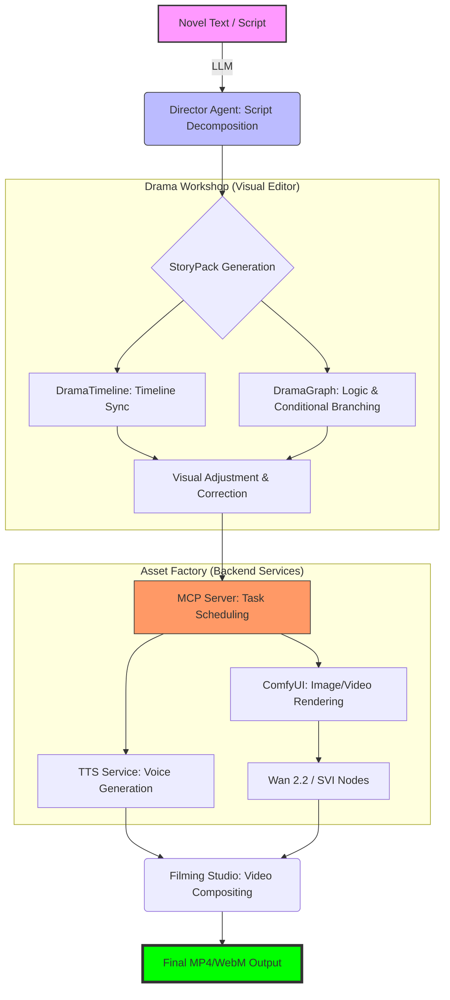

# 07. Drama Production Workflow

## End-to-End Drama Production Flowchart

This flowchart illustrates the end-to-end automated pipeline from novel text to final video output.

## Key Technical Points

1.  **Director Agent**: Responsible for converting natural language into `StoryPack` JSON.
2.  **Drama Workshop**:
    - `DramaTimeline`: Handles precise synchronization of sound effects, voice, and camera.
    - `DramaGraphEditor`: Built on VueFlow, enables editing of non-linear script structures.
3.  **Task Queue**:
    - **default queue**: Handles TTS and data conversion (CPU-intensive).
    - **gpu_queue**: Dedicated to ComfyUI rendering and video compositing (VRAM-intensive).
