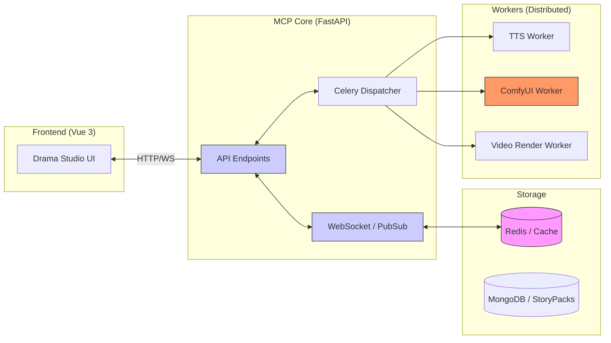

# MCP Server System Architecture (MCP Architecture)

## @Overview

The `moyin-mcp-server` serves as the central orchestration hub, seamlessly connecting the frontend UI with various backend rendering services, including TTS, ComfyUI, and the Video Synthesis engine.

---

## 🏛 Architectural Diagram

---

## 📡 Communication Protocols & Data Orchestration

1.  **Command Channel**:
    Utilized for dispatching production instructions (e.g., `start_render`) to the backend workers.
2.  **Status Sync**:
    Implements real-time status synchronization based on Redis PubSub, allowing the frontend UI to monitor task progress dynamically.
3.  **Data Sync**:
    Standardizes on the `StoryPack` schema as the primary data exchange format between all nodes, ensuring data integrity across the distributed pipeline.

---

👉 **[Next Step: Model Studio Integration Workflow](./09.Model_Studio_Integration.md)**
