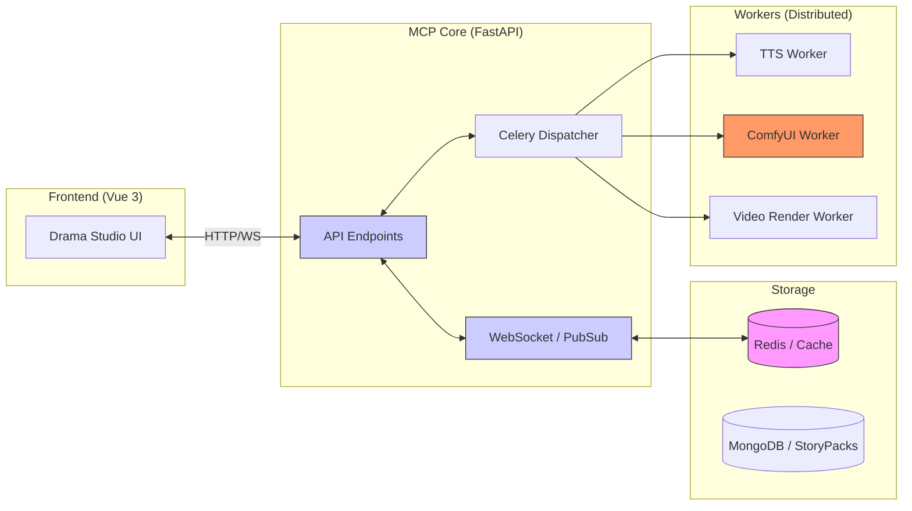

# 08. Moyin MCP Architecture: The Central Nervous System of AI Drama Production

## @Overview

Hello, I'm AKIRA.
Today we explain the brainstem of Moyin: the architecture of `moyin-mcp-server`.

The Drama Studio UI receives intuitive user instructions on the frontend—but how do those instructions precisely reach the multiple massive backend services like TTS, ComfyUI, and video compositing? Today we reveal the design philosophy of that "central nervous system."

---

## 🏛 MCP Server Full Architecture Diagram

`moyin-mcp-server` is the core coordination hub connecting the frontend UI with backend rendering services.

---

## 🔍 Detailed Layer Breakdown

### 🖥 Frontend Layer: Drama Studio UI (Vue 3)

The sole touchpoint where users edit scripts and issue production instructions. This UI communicates with MCP Core via two channels:

- **HTTP REST API**: StoryPack CRUD, job status retrieval, etc.
- **WebSocket**: Real-time progress streaming ("TTS 30% complete," etc.)

### ⚙️ MCP Core Layer (FastAPI)

**API Endpoints**

- Manages receipt and distribution of script data (StoryPack) via REST endpoints
- Gatekeeper for authentication, validation, and rate limiting

**WebSocket / PubSub**

- Real-time communication layer built on Redis's PubSub mechanism
- Pushes worker progress to the frontend in real-time
- Supports simultaneous broadcast to multiple clients

**Celery Dispatcher**

- Orchestrator for the distributed task queue
- Routes tasks to queues based on their nature:
  - `default_queue`: CPU-intensive (TTS, JSON processing)
  - `gpu_queue`: GPU-intensive (ComfyUI, video compositing)

### 💾 Storage Layer

**Redis (Cache + PubSub Broker)**

- Manages task queues as Celery's broker
- Relays real-time status sync messages via PubSub
- Caches high-frequency access data (StoryPack hot data)

**MongoDB (Persistent Storage)**

- Persists the complete JSON structure of StoryPacks
- Manages production job history, status, and output paths
- Document-oriented design perfectly matches StoryPack's flexible schema

### 🏭 Workers Layer (Distributed Workers)

Each worker runs as an independent process and is easy to scale out:

**TTS Worker**

- Character-specific voice synthesis using GPT-SoVITS
- CPU-heavy, so assigned to `default_queue`
- Dynamic voice style adjustment based on emotion parameters

**ComfyUI Worker**

- AI video generation using Wan 2.2 / SVI nodes
- GPU-heavy, so assigned to `gpu_queue`
- Multiple ComfyUI instances can be parallelized as a form farm

**Video Render Worker**

- FFmpeg-based final video compositing
- Synchronously composites audio and video tracks using timecodes

---

## 📡 Communication Protocol Design

| Channel         | Protocol                 | Purpose                                            |
| --------------- | ------------------------ | -------------------------------------------------- |
| Command Channel | HTTP REST                | Sending production commands (`start_render`, etc.) |
| Status Sync     | WebSocket + Redis PubSub | Streaming real-time progress to UI                 |
| Data Sync       | StoryPack JSON           | Data exchange format between nodes                 |

---

## 💡 Why FastAPI + Celery + Redis?

**Why FastAPI?** Auto-generated documentation (OpenAPI) integrates with Python's type system for seamless coordination with AI workers.

**Why Celery?** Built-in task retry, prioritization, and dead-letter queues (failed task handling). For long-running tasks like video generation, automatic retries on failure are essential.

**Why Redis?** Its in-memory speed serves double duty as both a high-performance cache and a low-latency PubSub message broker—balancing infrastructure simplicity (cost reduction) with performance.

---

👉 **[Next: Model Studio Integration](./09.Model_Studio_Integration.md)**
