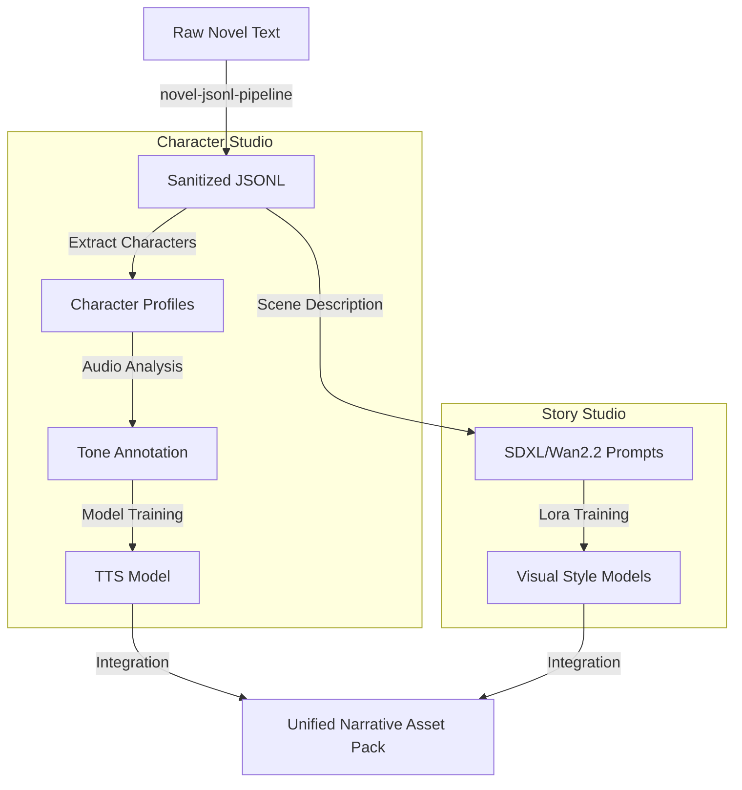

# Model Studio Integration: Machine Learning Pipeline (Model Studio Integration)

## @Overview

This document illustrates how `moyin-model-studio` integrates automated narrative pipelines with character-specific voice and visual training modules to generate high-fidelity AI assets.

---

## 🧠 Model Training & Data Synthesis Workflow

---

## 🎯 Integration Objectives

1.  **Low-Code Interface**: Reconstructing the training pipeline using a VueFlow (Vue 3) based interface for visual orchestration.
2.  **Dataset Automation**: Automatically transforming long-form novel texts into high-quality training datasets with minimal manual intervention.
3.  **Cross-Model Alignment**: Ensuring that a character's visual LoRA and their specific TTS voice are perfectly aligned during the inferenced production phase.

---

👉 **[Next Step: StoryPack Data Lifecycle](./10.StoryPack_Data_Flow.md)**
