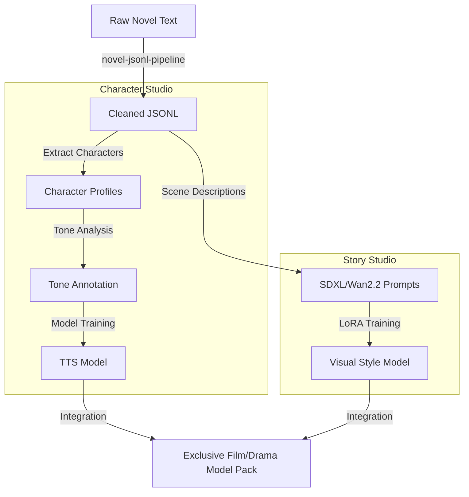

# 09. Model Studio Integration: Training Pipeline from Novel to AI Models

## @Overview

Hello, I'm AKIRA.
Today we explain one of Moyin's most ambitious visions: `moyin-model-studio`.

"I want to create a video with the voice and face of this novel's characters"—hearing this, most people would think "isn't that something you do manually? Incredibly tedious work." What Moyin aims for is a world where you pour in novel text and the character-specific TTS voice models and visual style LoRA models are automatically generated.

---

## 🧠 Model Training & Data Generation Flow

This shows how `moyin-model-studio` integrates the novel pipeline with character voice/appearance training.



---

## 🔍 Detailed Stage Breakdown

### 📄 Input: Raw Novel Text

Plain text of a full-length novel is the pipeline's starting point. Even novels hundreds of thousands of characters long are automatically processed by this pipeline.

### 🧹 Pre-processing: novel-jsonl-pipeline

A dedicated pipeline for text cleansing and structured conversion:

- Automatic chapter and scene splitting
- Character name normalization and unification (merging different forms of address)
- Separation of dialogue and scene descriptions
- Conversion to `JSONL` (JSON Lines) format (optimal for training data)

---

## 🎙 Character Studio: The Voice Cloning Factory

### 👤 Character Profiles

Extracts each character from the cleaned JSONL and builds profiles:

- Appearance frequency and relationship mapping
- Statistical analysis of emotional patterns (does this character often get angry? Cry?)
- Automatic collection of character dialogue lines

### 🎵 Tone Annotation

Labels character dialogue data with emotion and voice quality tags:

- Emotion categories (joy, anger, sadness, surprise, fear, etc.)
- Parameter estimation for speaking speed, volume, and pitch
- Voice classification based on age, gender, and personality

### 🗣 TTS Model Training (GPT-SoVITS)

Trains a character-specific voice synthesis model using annotated data:

- Fine-tunable even with small samples (dozens of lines)
- Higher quality possible with actual voice actor data

---

## 🎨 Story Studio: The Visual Style Cloning Factory

### 📝 Scene Description → AI Prompt Conversion

Converts novel scene descriptions into prompts for image generation AI:

- Extraction of setting, background, and lighting
- Structuring of character appearance descriptions
- Prompt template generation for `SDXL` / `Wan 2.2`

### 🎨 Visual Style LoRA Training

Trains character-specific visual style models using generated prompts and reference images:

- LoRA adapters maintaining character appearance consistency
- Unification of art style across the entire work (anime style, realistic style, etc.)

---

## 📦 Final Output: Exclusive Film/Drama Model Pack

TTS models and visual style models are consolidated into one package and handed off to the Drama Production Workflow (No. 07):

```
model_pack/
├── tts/
│   ├── character_A.pth    # Character A's voice model
│   └── character_B.pth
├── visual/
│   ├── style_lora.safetensors  # Work style LoRA
│   └── character_A_lora.safetensors
└── metadata.json          # Model metadata
```

---

## 🎯 Design Goals

| Goal                      | Details                                                                       |
| ------------------------- | ----------------------------------------------------------------------------- |
| **Low-Code Interface**    | Visually edit and manage training pipelines with VueFlow (Vue 3)              |
| **Dataset Automation**    | Full automation: long-form novel → high-quality training dataset              |
| **Cross-Model Alignment** | Highly align the same character's visual LoRA and TTS voice during production |

---

## 💡 Why Is This Approach Revolutionary?

In traditional AI content production, matching a character's voice and appearance requires:

1. Hiring voice actors for recording (high cost)
2. Manual prompt adjustment for image generation AI (time-consuming)
3. Manual execution of TTS fine-tuning (requires expertise)

Moyin automates all three by simply "pouring in novel text." For a million-character novel, 100 characters can be processed in parallel.

---

👉 **[Next: StoryPack Data Flow](./10.StoryPack_Data_Flow.md)**
