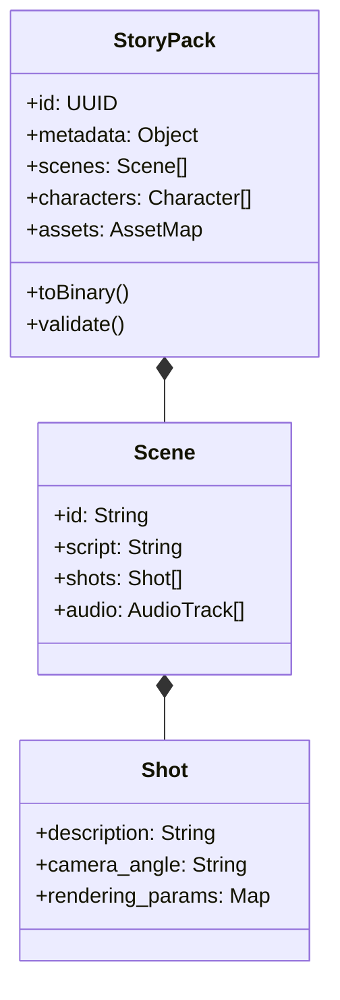

# 10. StoryPack Data Flow

## StoryPack Exchange Format Standard

`StoryPack` is Moyin's universal data carrier, ensuring consistency from creation through rendering.

## Data Flow Process

1.  **Creation Phase**: `moyin-web` generates the initial content.
2.  **Enhancement Phase**: `Director Agent` enriches storyboard and camera details.
3.  **Distribution Phase**: `MCP Server` splits and dispatches packages to different Workers.
4.  **Reporting Phase**: Workers update output artifact paths (e.g., `video_url`) in the `StoryPack`.
