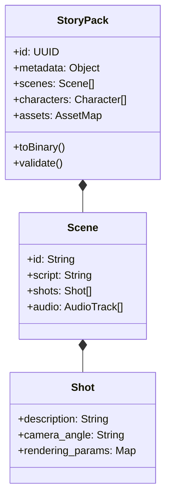

# StoryPack Schema & Data Lifecycle (StoryPack Data Flow)

## @Overview

`StoryPack` is the universal data carrier for the entire Moyin ecosystem. It serves as the primary exchange format, ensuring absolute data consistency from initial creative ideation to final asset rendering and output.

---

## 📦 StoryPack Exchange Format Standards

```mermaid
classDiagram
    class StoryPack {
        +id: UUID
        +metadata: Object
        +scenes: Scene[]
        +characters: Character[]
        +assets: AssetMap
        +toBinary()
        +validate()
    }

    class Scene {
        +id: String
        +script: String
        +shots: Shot[]
        +audio: AudioTrack[]
    }

    class Shot {
        +description: String
        +camera_angle: String
        +rendering_params: Map
    }

    StoryPack *-- Scene
    Scene *-- Shot
```

---

## 🔄 Data Orchestration Lifecycle

1.  **Creation Phase**:
    `moyin-web` or an AI agent generates the initial script and core narrative structure.
2.  **Enhancement Phase**:
    The `Director Agent` analyzes the `StoryPack` to enrich it with cinematic details, camera angles, and rendering parameters.
3.  **Distribution Phase**:
    The `MCP Server` deconstructs and packages the `StoryPack` into individual tasks, dispatching them to specialized distributed workers.
4.  **Reporting Phase**:
    Upon completion, workers update the asset paths (e.g., `video_url`, `audio_path`) within the `StoryPack`, finalizing the integrated result for presentation.

---

👉 **[Back to Knowledge Home](../../HOME.md)**
