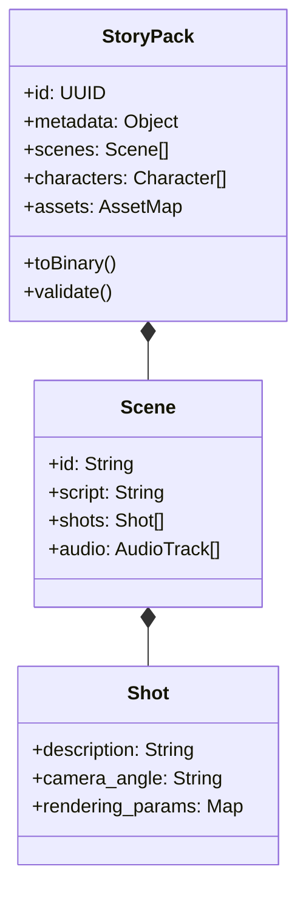

# 10. StoryPack Data Flow: Moyin's Universal Language

## @Overview

Hello, I'm AKIRA.
Today we explain `StoryPack`—the "blood" flowing through the entire Moyin project—its data structure and flow.

One of the most important architectural decisions in software is **"what do you pass between components?"** In Moyin, every component—Director Agent, Drama Workshop, MCP Server, TTS Worker, ComfyUI Worker, and video compositing—converses using the common format called `StoryPack`.

---

## 📦 StoryPack Class Diagram

`StoryPack` is Moyin's universal data carrier, ensuring consistent connectivity from creation to rendering.


```mermaid
classDiagram
    class StoryPack {
        +id: UUID
        +metadata: Object
        +scenes: Scene[]
        +characters: Character[]
        +assets: AssetMap
        +toBinary()
        +validate()
    }

    class Scene {
        +id: String
        +script: String
        +shots: Shot[]
        +audio: AudioTrack[]
    }

    class Shot {
        +description: String
        +camera_angle: String
        +rendering_params: Map
    }

    StoryPack *-- Scene
    Scene *-- Shot
```

---

## 🔍 Detailed Field Breakdown

### 🏷 StoryPack (Root Object)

| Field        | Type        | Role                                                        |
| ------------ | ----------- | ----------------------------------------------------------- |
| `id`         | UUID        | Key that uniquely identifies every production job           |
| `metadata`   | Object      | Work title, version, author info, production settings, etc. |
| `scenes`     | Scene[]     | Array of all scenes (ordered)                               |
| `characters` | Character[] | Cast of characters and their model references               |
| `assets`     | AssetMap    | Path map of generated voice/video/image files               |
| `toBinary()` | Method      | Binary serialization (for high-speed transfer)              |
| `validate()` | Method      | Data integrity check (validation before Worker receipt)     |

### 🎬 Scene (Scene Object)

A unit representing one continuous scene:

| Field    | Type         | Role                                      |
| -------- | ------------ | ----------------------------------------- |
| `id`     | String       | Scene identifier (e.g., `scene_01`)       |
| `script` | String       | Dialogue/narration text for this scene    |
| `shots`  | Shot[]       | Camera shots composing this scene         |
| `audio`  | AudioTrack[] | Audio tracks (BGM, SFX, character voices) |

### 🎥 Shot (Shot Object)

The smallest unit in video production—one camera angle and composition:

| Field              | Type   | Role                                                     |
| ------------------ | ------ | -------------------------------------------------------- |
| `description`      | String | Natural language description of shot content             |
| `camera_angle`     | String | Camera angle (`close_up`, `wide`, `over_shoulder`, etc.) |
| `rendering_params` | Map    | Collection of rendering parameters passed to ComfyUI     |

---

## 🔄 The 4-Phase Data Flow

```
Phase 1: Creation
moyin-web → Director Agent
└── Generates StoryPack v1 (basic structure only)

Phase 2: Enhancement
v1 → Director Agent / Drama Workshop
└── StoryPack v2 (storyboards, emotions, camera work added)

Phase 3: Distribution
v2 → MCP Server → Workers
└── Split by scene and distributed to each Worker

Phase 4: Reporting
Workers → MCP Server
└── Completed audio/video URLs written back to StoryPack
```

### ① Creation Phase

`moyin-web` constructs an initial StoryPack from user input. At this stage, only basic scene structure and dialogue are included.

### ② Enhancement Phase

`Director Agent` analyzes scenes and adds storyboards, emotion labels, and camera direction. Users can also manually adjust via Drama Workshop.

### ③ Distribution Phase

`MCP Server` splits the StoryPack by scene and distributes to appropriate Worker queues:

- Text scripts → TTS Worker
- Shot descriptions → ComfyUI Worker
- After both complete → Video Render Worker

### ④ Reporting Phase

After processing, each Worker writes the URLs of generated audio/video files back into the StoryPack's `assets` field. Ultimately, the StoryPack becomes "a complete map of all production artifacts."

---

## 💡 Why Is the StoryPack Common Format Important?

**Realizing Interface Contracts**: TTS Workers only need to know "receive a StoryPack, return a StoryPack." Same for ComfyUI Workers. This minimizes coupling between components and makes swapping parts easy (e.g., migrating to a different TTS engine).

**Consistent Validation**: The `validate()` method provides common data integrity checks across all components—detecting bugs like "a scene's shot is missing" or "audio track timecodes are diverging" before production even begins.

**Complete Audit Trail**: Storing each version of StoryPack in MongoDB preserves a record of every step in the production process. When problems arise, you can fully trace "which Worker changed what and when."

---

👉 **[Back to: Moyin Group Overview](./00.Moyin_Group_Overview.md)**
