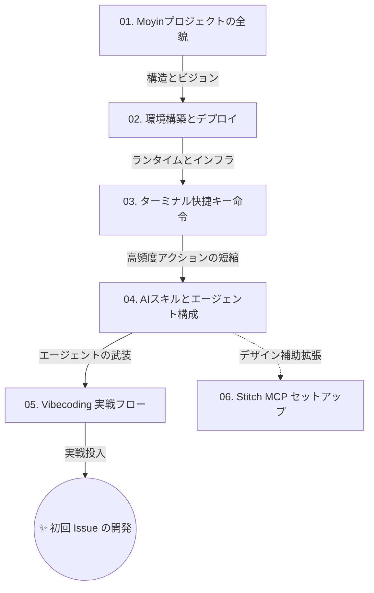

# Moyin オンボーディング基地 (Onboarding Guide)

## @Overview

Moyinプロジェクトへようこそ！本ガイドは、新規参画メンバーがプロジェクトの全体像を把握し、ターミナルレベルでの開発環境を構築するための最短経路を示したものです。2026年の標準となる「**Vibecoding (雰囲気駆動開発)**」のリズムを習得し、ストレスフリーかつ高効率な開発体験を確立しましょう。

---

## 🗺️ 学習ロードマップ (Learning Map)

効率的な習得のため、以下のステップ順に従って各ドキュメントを確認することを推奨します。

---

## 📂 ガイド目録

### フェーズ 1：基礎構築とパラダイムの理解 (Phase 1: Getting Started)

ローカル環境を「AI エージェントが即座に介入し、自律的に動作できる戦闘環境」へと仕立て上げることがこのフェーズの目標です。

1.  **[01. Moyinプロジェクトの全貌](./01_welcome_to_moyin.md)**
    - プロジェクトのビジョン、マイクロサービスの境界、そして「全知の脳」である Knowledge Base の重要性を理解します。
2.  **[02. 環境構築とデプロイ](./02_environment_setup.md)**
    - `Node.js`, `Python`, `pnpm`, `uv` といった、プロジェクト点火に必要なランタイムツール群を導入します。
3.  **[03. ターミナル快捷キー命令 (Alias Guide)](./03_powershell_alias_cheat_sheet.md)**
    - 冗長な指令を Alias 化し、タイピングと記憶のコストを最小化する手法を学びます。
4.  **[04. AIスキルとエージェント構成](./04_skills_and_agents.md)**
    - `.agent/` ディレクトリの役割と、AI に「手足」を与える MCP プロトコルの活用法を習得します。
5.  **[05. Vibecoding 実戦フロー](./05_vibecoding_workflow.md)**
    - **本ガイドの核心**。AI に「命令」し、安全かつ高速にコードをアウトソーシングするための標準作業手順を体験します。
6.  **[06. Google Stitch MCP セットアップ (Optional)](./06_stitch_mcp_setup.md)**
    - AI に「神の視覚」を与え、画像からフロントエンドコードを自動生成するための高度な外部連携について学びます。

---

## 💡 アーキテクトからのメッセージ

この 6 つの基礎ステップを完了した時点で、あなたは「Moyin プロジェクトの AI ナビゲーター」としての資格を手に入れます。

自らキーボードを叩くのではなく、AI という強力な補佐の「視点」と「力量」を管理・活用し、最初のエコシステム構築に踏み出してください。バージョン管理という安全網があれば、恐れることは何もありません。

---

👉 **[Next Step: 01. Moyinプロジェクトの全貌](./01_welcome_to_moyin.md)**
