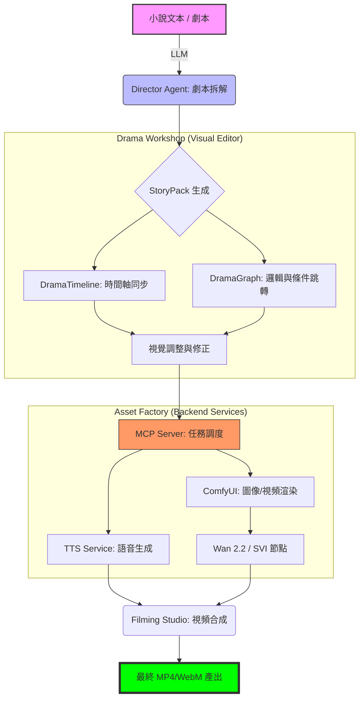

# 07. Drama Production Workflow

## 🎭 漫劇生產全流程圖

本流程圖展示了從「小說文本」到「最終視訊成果」的端到端自動化路徑。

## 🛠 關鍵技術點

1.  **Director Agent**: 負責將自然語言轉化為 `StoryPack` JSON。
2.  **Drama Workshop**:
    - `DramaTimeline`: 處理音效、語音、鏡頭的精確同步。
    - `DramaGraphEditor`: 基於 VueFlow，允許編輯非線性劇本結構。
3.  **Task Queue**:
    - **default queue**: 處理 TTS 與數據轉換（CPU 密集型）。
    - **gpu_queue**: 專供 ComfyUI 渲染與視頻合成（VRAM 密集型）。
