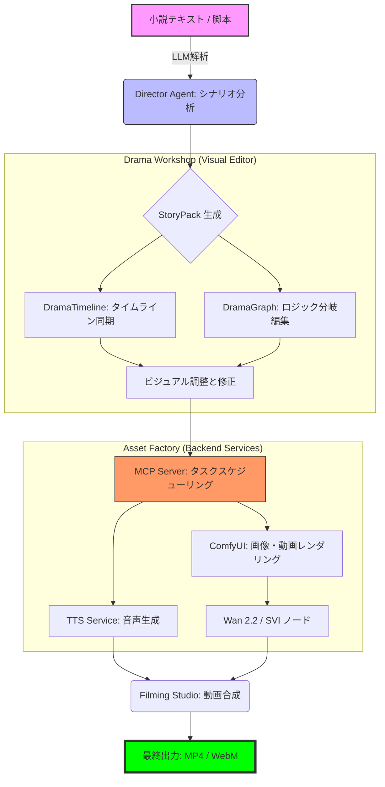

# AI 映像制作パイプライン (Drama Production Workflow)

## @Overview

本ワークフローは、テキストベースの「小説/脚本」から「最終的な映像作品」までを、AI を介してシームレスに自動生成するエンドツーエンドの制作経路を示しています。

---

## 🎭 制作フローチャート

```mermaid
graph TD
    A[小説テキスト / 脚本] -->|LLM解析| B(Director Agent: シナリオ分析)
    B --> C{StoryPack 生成}

    subgraph "Drama Workshop (Visual Editor)"
        C --> D[DramaTimeline: タイムライン同期]
        C --> E[DramaGraph: ロジック分岐編集]
        D & E --> F[ビジュアル調整と修正]
    end

    F --> G[MCP Server: タスクスケジューリング]

    subgraph "Asset Factory (Backend Services)"
        G --> H[TTS Service: 音声生成]
        G --> I[ComfyUI: 画像・動画レンダリング]
        I --> J[Wan 2.2 / SVI ノード]
    end

    H & J --> K(Filming Studio: 動画合成)
    K --> L[最終出力: MP4 / WebM]

    style A fill:#f9f,stroke:#333,stroke-width:2px
    style L fill:#00ff00,stroke:#333,stroke-width:4px
    style B fill:#bbf,stroke:#333
    style G fill:#f96,stroke:#333
```

---

## 🛠 核心技術解説

1.  **Director Agent (ディレクター・エージェント)**:
    自然言語を解析し、映像演出データである `StoryPack` (JSON 形式) へと変換します。
2.  **Drama Workshop (ドラマ・ワークショップ)**:
    - `DramaTimeline`: 効果音、ボイス、カメラワークの精密な同期を制御します。
    - `DramaGraphEditor`: VueFlow をベースに、非線形なドラマ構造の編集を可能にします。
3.  **Task Queue (タスクキュー管理)**:
    - **Default Queue**: TTS およびデータ変換（CPU 集中型タスク）。
    - **GPU Queue**: ComfyUI レンダリング、動画合成（VRAM 集中型タスク）。

---

👉 **[Next Step: MCP アーキテクチャの詳細](./08.Moyin_MCP_Architecture.md)**
