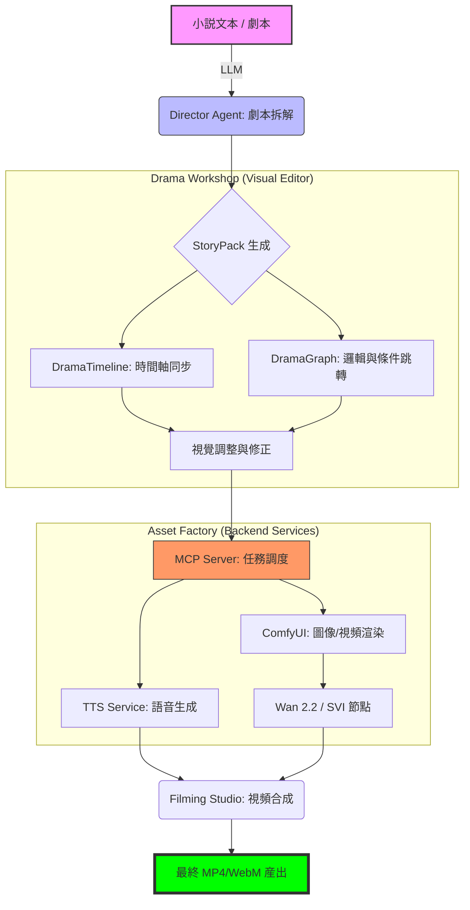

# 07. AI ドラマ制作ワークフロー：小説テキストから MP4 映像まで（Drama Production Workflow）

## @Overview

こんにちは、AKIRA です。
今回は Moyin プロジェクトの核心部分、「AI ドラマ制作パイプライン」の全体像を解剖します。

「小説のテキストを書いたら、あとは AI が全部やってくれる」——これが Moyin が目指す世界です。しかし実際には、その「全部」の内側には精巧な多段階パイプラインが動いています。今日はその端から端まで（End-to-End）の設計図をご紹介します。

---

## 🎭 ドラマ生産フルフロー図

小説テキストから最終映像成果物までの、自動化された端から端へのパスを示します。

```mermaid
graph TD
    A[小説文本 / 劇本] -->|LLM| B(Director Agent: 劇本拆解)
    B --> C{StoryPack 生成}

    subgraph "Drama Workshop (Visual Editor)"
        C --> D[DramaTimeline: 時間軸同步]
        C --> E[DramaGraph: 邏輯與條件跳轉]
        D & E --> F[視覺調整與修正]
    end

    F --> G[MCP Server: 任務調度]

    subgraph "Asset Factory (Backend Services)"
        G --> H[TTS Service: 語音生成]
        G --> I[ComfyUI: 圖像/視頻渲染]
        I --> J[Wan 2.2 / SVI 節點]
    end

    H & J --> K(Filming Studio: 視頻合成)
    K --> L[最終 MP4/WebM 産出]

    style A fill:#f9f,stroke:#333,stroke-width:2px
    style L fill:#00ff00,stroke:#333,stroke-width:4px
    style B fill:#bbf,stroke:#333
    style G fill:#f96,stroke:#333
```

---

## 🔍 各ノードの詳細解説

### 📝 起点：小説テキスト / 脚本

すべての始まりは自然言語のテキストです。長編小説でも短編脚本でも、Director Agent への入力として機能します。

### 🤖 Director Agent：脚本解体エンジン

LLM（大言語モデル）を核心とするこのエージェントは、自然言語の物語を構造化された `StoryPack` JSON フォーマットに変換します：

- シーン分割と順序付け
- キャラクター識別と感情ラベリング
- カメラアングルとショット指示の生成
- 条件分岐（選択肢）の定義

### 🎬 Drama Workshop：ビジュアルエディタ层

人間がパイプラインに介入できる重要な中間層です：

**DramaTimeline（タイムライン同期）**

- 音声、BGM、カメラショットの精密なタイムコード同期
- フレーム単位の調整が可能

**DramaGraph（非線形脚本エディタ）**

- VueFlow（Vue 3 ベース）で実装されたノードエディタ
- 分岐シナリオ（IF/ELSE ロジック）の視覚的編集
- キャラクターの条件付き感情変化の管理

### ⚙️ MCP Server：タスクスケジューラ

調整完了後、MCP（Model Context Protocol）サーバーがオーケストレーターとして機能します：

- タスクを適切なワーカーキューに振り分け
- `default_queue`：CPU 集中型タスク（TTS・データ変換）
- `gpu_queue`：GPU 集中型タスク（ComfyUI レンダリング・映像合成）

### 🎨 Asset Factory：バックエンドサービス群

**TTS Service（音声生成）**

- GPT-SoVITS でキャラクター固有の音声を合成
- 感情ラベルに応じた音量・速度・ピッチの自動調整

**ComfyUI（画像/映像レンダリング）**

- Wan 2.2 / SVI ノードを使った高品質映像生成
- キャラクター外見の一貫性を保つ LoRA モデル適用

### 🎞️ Filming Studio：最終映像合成

音声トラックと映像フレームを同期合成し、最終的な MP4/WebM ファイルを出力します。

---

## 🛠 重要技術ポイントまとめ

| コンポーネント | 技術              | 役割                         |
| -------------- | ----------------- | ---------------------------- |
| Director Agent | LLM (Claude/GPT)  | 自然言語 → StoryPack JSON    |
| DramaTimeline  | Vue 3 + Tone.js   | タイムコード同期エディタ     |
| DramaGraph     | VueFlow           | 非線形シナリオグラフエディタ |
| MCP Server     | FastAPI + Celery  | タスクキュー管理             |
| TTS            | GPT-SoVITS        | キャラクター音声合成         |
| 映像生成       | ComfyUI + Wan 2.2 | AI 映像レンダリング          |

---

## 💡 なぜこのアーキテクチャなのか？

**人間が制御できる中間点（Drama Workshop）を設けた理由**：AI が生成した脚本は完璧ではありません。キャラクターの感情やカメラワークがイメージと異なることがあります。ビジュアルエディタ層を挟むことで、「完全自動化」と「人間の創造性」の最適なバランスを実現しています。

**キューを分離した理由**：TTS は CPU が支配する世界、映像生成は GPU が支配する世界です。同じキューに混ぜると、GPU タスクが CPU タスクを待ち続けるか、逆に CPU タスクが GPU の順番待ちで詰まります。専用キューで最大スループットを実現します。

---

👉 **[Next: MCP アーキテクチャ詳細](./08.Moyin_MCP_Architecture.md)**
