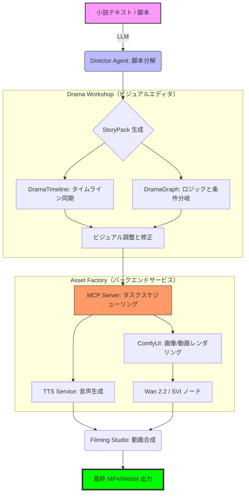

# 07. ドラマ制作ワークフロー（Drama Production Workflow）

## 漫劇制作の全体フローチャート

本フローチャートは、「小説テキスト」から「最終映像成果物」までのエンドツーエンド自動化パイプライン（Pipeline）を示しています。

## 主要技術ポイント

1.  **Director Agent**: 自然言語を `StoryPack` JSON に変換する役割を担います。
2.  **Drama Workshop**:
    - `DramaTimeline`: 効果音、音声、カメラの精密な同期を処理します。
    - `DramaGraphEditor`: VueFlow ベースで、非線形脚本構造の編集を可能にします。
3.  **タスクキュー（Task Queue）**:
    - **default queue**: TTS とデータ変換を処理（CPU 集約型）。
    - **gpu_queue**: ComfyUI レンダリングと動画合成専用（VRAM 集約型）。
