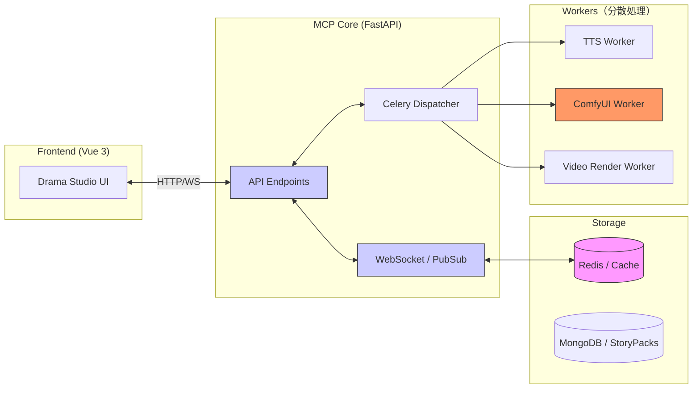

# 08. Moyin MCP アーキテクチャ（Architecture）

## MCP Server アーキテクチャ図

`moyin-mcp-server` は中央ディスパッチ（Dispatch）ハブとして機能し、フロントエンド UI とバックエンドの各種レンダリングサービスを接続します。

## 通信プロトコル

- **Command Channel**: 制作コマンドの送信に使用します（例：`start_render`）。
- **Status Sync**: Redis PubSub ベースのリアルタイム状態同期。フロントエンド UI がタスクの進捗を監視します。
- **Data Sync**: `StoryPack` をノード間のデータ交換フォーマットとして使用します。
