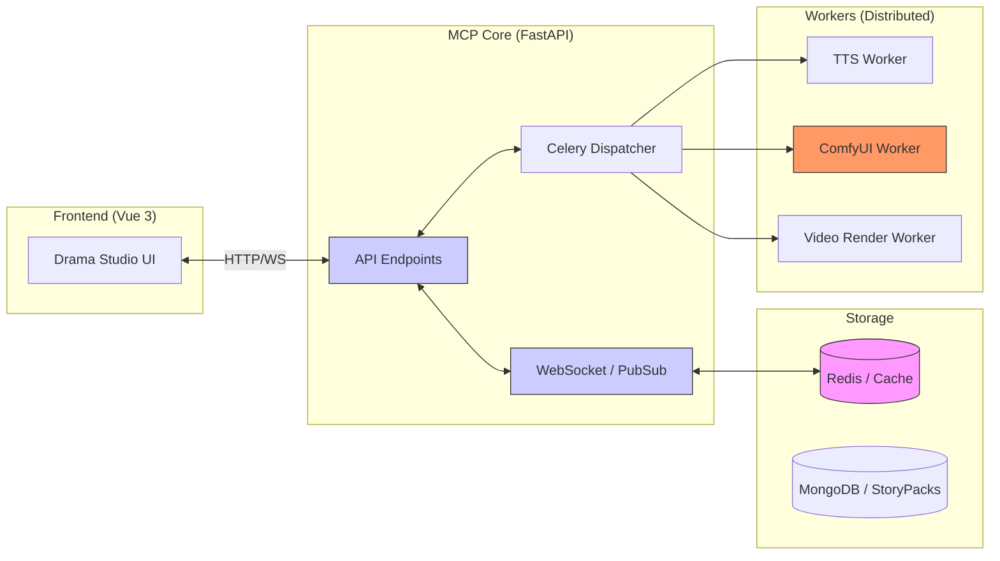

# 08. Moyin MCP アーキテクチャ：AI ドラマ制作の中枢神経（MCP Architecture）

## @Overview

こんにちは、AKIRA です。
今回は Moyin の脳幹部分、`moyin-mcp-server` のアーキテクチャを解説します。

フロントエンドの Drama Studio UI がユーザーの直感的な操作を受け取り、それをどうやってバックエンドの TTS・ComfyUI・映像合成といった複数の巨大サービスへ的確に届けるのか？その「中央神経システム」の設計思想を今日は公開します。

---

## 🏛 MCP Server 全体アーキテクチャ図

`moyin-mcp-server` は、フロントエンド UI とバックエンドの各レンダリングサービスを接続する中核調整ハブです。

```mermaid
graph LR
    subgraph "Frontend (Vue 3)"
        WebUI[Drama Studio UI]
    end

    subgraph "MCP Core (FastAPI)"
        API[API Endpoints]
        WS[WebSocket / PubSub]
        Celery[Celery Dispatcher]
    end

    subgraph "Storage"
        Redis[(Redis / Cache)]
        DB[(MongoDB / StoryPacks)]
    end

    subgraph "Workers (Distributed)"
        TTS[TTS Worker]
        Comfy[ComfyUI Worker]
        Video[Video Render Worker]
    end

    WebUI <-->|HTTP/WS| API
    API <--> WS
    WS <--> Redis
    API <--> Celery
    Celery --> TTS
    Celery --> Comfy
    Celery --> Video

    style API fill:#ccf,stroke:#333
    style WS fill:#ccf,stroke:#333
    style Redis fill:#f9f,stroke:#333
    style Comfy fill:#f96,stroke:#333
```

---

## 🔍 各レイヤーの詳細解説

### 🖥 フロントエンド層：Drama Studio UI（Vue 3）

ユーザーが脚本を編集し、制作指示を出す唯一の接点です。このUIは二つのチャンネルで MCP Core と通信します：

- **HTTP REST API**：脚本データのCRUD、ジョブ状態取得など
- **WebSocket**：リアルタイムの進行状況ストリーミング（「TTS 完了 30%」など）

### ⚙️ MCP Core層（FastAPI）

**API Endpoints**

- REST エンドポイントで脚本データ（StoryPack）の受け取りと配信を管理
- 認証・バリデーション・レート制限のゲートキーパー

**WebSocket / PubSub**

- Redis の PubSub メカニズムを基盤とするリアルタイム通信レイヤー
- Worker の進捗をフロントエンドへリアルタイムにプッシュ配信
- 複数クライアントへの同時ブロードキャスト対応

**Celery Dispatcher**

- 分散タスクキューのオーケストレーター
- タスクの性質に応じてキューを振り分け：
  - `default_queue`：CPU 集中型（TTS・JSON 加工）
  - `gpu_queue`：GPU 集中型（ComfyUI・映像合成）

### 💾 ストレージ層

**Redis（キャッシュ + PubSub ブローカー）**

- Celery のブローカーとしてタスクキューを管理
- PubSub でリアルタイム状態同期のメッセージを中継
- 高頻度アクセスデータのキャッシュ（StoryPack のホットデータ）

**MongoDB（永続化ストレージ）**

- StoryPack の完全な JSON 構造を永続化
- 制作ジョブの履歴・状態・成果物パスを管理
- ドキュメント指向のため StoryPack の柔軟なスキーマに最適

### 🏭 Workers層（分散ワーカー）

各ワーカーは独立したプロセスで動作し、スケールアウトが容易です：

**TTS Worker**

- GPT-SoVITS を使用したキャラクター固有の音声合成
- CPU ヘビーなタスクのため `default_queue` に所属
- 感情パラメータに基づく音声スタイルの動的調整

**ComfyUI Worker**

- Wan 2.2 / SVI ノードを使用した AI 映像生成
- GPU ヘビーなタスクのため `gpu_queue` に所属
- 複数の ComfyUI インスタンスをフォームファームとして並列化可能

**Video Render Worker**

- FFmpeg ベースの最終映像合成
- 音声・映像トラックをタイムコードで同期合成

---

## 📡 通信プロトコルの設計

| チャンネル      | プロトコル               | 用途                                     |
| --------------- | ------------------------ | ---------------------------------------- |
| Command Channel | HTTP REST                | 制作指令の送信（`start_render`など）     |
| Status Sync     | WebSocket + Redis PubSub | リアルタイム進捗の UI へのストリーミング |
| Data Sync       | StoryPack JSON           | ノード間のデータ交換フォーマット         |

---

## 💡 なぜ FastAPI + Celery + Redis の組み合わせなのか？

**FastAPI を選んだ理由**：自動ドキュメント生成（OpenAPI）と Python の型システムが統合され、AI ワーカーとのシームレスな連携が可能です。

**Celery を選んだ理由**：タスクの再試行・優先度付け・デッドレターキュー（失敗タスク処理）が組み込みで提供されます。映像生成のような長時間タスクでは、失敗時の自動リトライが不可欠です。

**Redis を選んだ理由**：InMemory な高速性でキャッシュとしても機能し、PubSub の低遅延メッセージブローカーとしても一台二役を果たします。インフラのシンプルさ（コスト低減）と性能を両立します。

---

👉 **[Next: Model Studio インテグレーション](./09.Model_Studio_Integration.md)**
