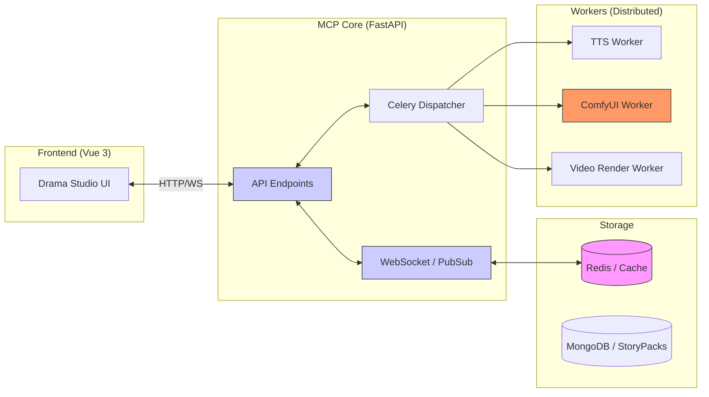

# MCP サーバー・システムアーキテクチャ (MCP Architecture)

## @Overview

`moyin-mcp-server` は、フロントエンド UI とバックエンドの各種レンダリングサービス（TTS, ComfyUI, Video Render）を統合する、プロジェクトの核心的な調度中枢です。

---

## 🏛 アーキテクチャ図 (Architectural Diagram)

```mermaid
graph LR
    subgraph "Frontend (Vue 3)"
        WebUI[Drama Studio UI]
    end

    subgraph "MCP Core (FastAPI)"
        API[API Endpoints]
        WS[WebSocket / PubSub]
        Celery[Celery Dispatcher]
    end

    subgraph "Storage"
        Redis[(Redis / Cache)]
        DB[(MongoDB / StoryPacks)]
    end

    subgraph "Workers (Distributed)"
        TTS[TTS Worker]
        Comfy[ComfyUI Worker]
        Video[Video Render Worker]
    end

    WebUI <-->|HTTP/WS| API
    API <--> WS
    WS <--> Redis
    API <--> Celery
    Celery --> TTS
    Celery --> Comfy
    Celery --> Video

    style API fill:#ccf,stroke:#333
    style WS fill:#ccf,stroke:#333
    style Redis fill:#f9f,stroke:#333
    style Comfy fill:#f96,stroke:#333
```

---

## 📡 通信プロトコルとデータ制御

1.  **Command Channel (コマンドチャンネル)**:
    生産指示（例: `start_render`）を送信するためのエンドポイント。
2.  **Status Sync (ステータス同期)**:
    Redis Pub/Sub に基づくリアルタイムなステータス同期。フロントエンド UI はタスクの進捗状況をリアルタイムでリスニングします。
3.  **Data Sync (データ同期)**:
    各ノード間のデータ交換フォーマットとして、独自定義の `StoryPack` を採用し、データの整合性を担保します。

---

👉 **[Next Step: Model Studio 統合フロー](./09.Model_Studio_Integration.md)**
