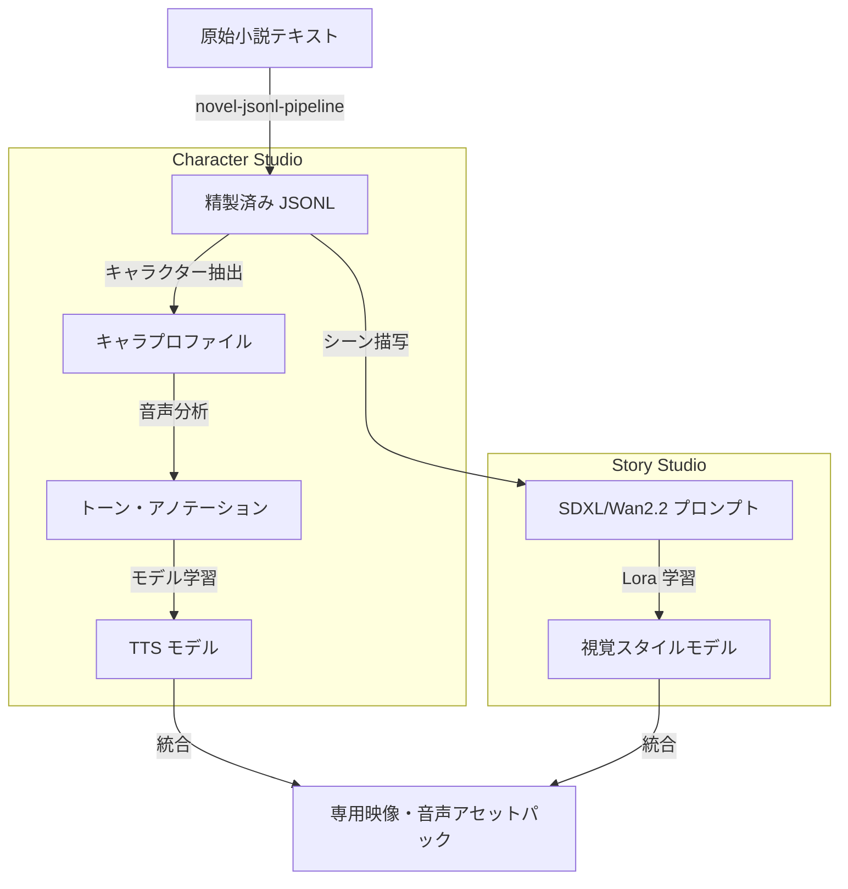

# Model Studio 統合フロー：機械学習パイプライン (Model Studio Integration)

## @Overview

`moyin-model-studio` における、小説テキストの抽出からキャラクター固有の音声（TTS）およびビジュアル（LoRA）モデルの学習、そして最終的なアセット統合までの自動化パイプラインを解説します。

---

## 🧠 モデル学習とデータ生成プロセス

---

## 🎯 統合と自動化の目標

1.  **Low-Code Interface**: VueFlow (Vue 3) を採用し、複雑な学習パイプラインを視覚的に制御・再構築可能にします。
2.  **Dataset Automation**: 長編小説を自動解析し、教師データとしての高品質なデータセットへ変換します。
3.  **Cross-Model Alignment**: 同一キャラクターにおいて、視覚的な LoRA モデルと聴覚的な TTS 音声が、実際の生成時に高度に同期・整合するシステムを構築します。

---

👉 **[Next Step: StoryPack データフローの詳細](./10.StoryPack_Data_Flow.md)**
