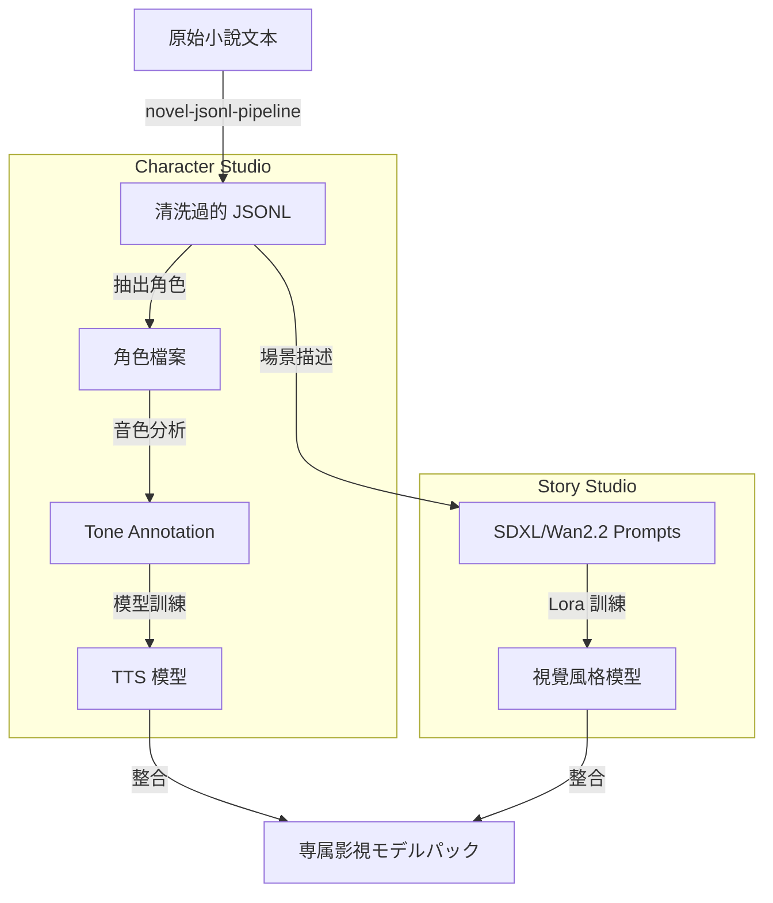

# 09. Model Studio インテグレーション：小説から AI モデルへの訓練パイプライン（Model Studio Integration）

## @Overview

こんにちは、AKIRA です。
今回は Moyin の最も野心的な構想の一つ、`moyin-model-studio` を解説します。

「この小説のキャラクターの声と顔で映像を作りたい」——し聞いたら多くの人は「それって手動でやるやつでしょ、めちゃくちゃ大変じゃないの」と思うでしょう。Moyin が目指すのは、小説テキストを流し込むだけで、そのキャラクター専用の TTS 音声モデルと視覚スタイル LoRA モデルが自動的に生成される世界です。

---

## 🧠 モデル訓練・データ生成フロー図

`moyin-model-studio` が小説パイプラインとキャラクターの声色・外見訓練をどのように統合するかを示します。



---

## 🔍 各ステージの詳細解説

### 📄 入力：原始小説テキスト

長編小説のプレーンテキストがパイプラインの起点です。数十万文字の小説でも、このパイプラインが自動処理します。

### 🧹 前処理：novel-jsonl-pipeline

テキストクレンジングと構造化変換の専用パイプライン：

- 章・シーンの自動分割
- キャラクター名の正規化と統一（異なる呼び名を統合）
- 対話文と情景描写の分離
- `JSONL`（JSON Lines）形式への変換（訓練データとして最適）

---

## 🎙 Character Studio：声のクローニング工場

### 👤 キャラクタープロファイル（Profiles）

クレンジングされた JSONL から各キャラクターを抽出し、プロファイルを構築：

- 登場頻度・関係性マッピング
- 感情パターンの統計分析（このキャラクターはよく怒る？泣く？）
- セリフ集の自動収集

### 🎵 音色アノテーション（Tone Annotation）

キャラクターのセリフデータに感情・声質ラベルを付与：

- 感情カテゴリ（喜怒哀楽・驚き・恐怖など）
- 話す速度・音量・ピッチのパラメータ推定
- 年齢・性別・性格に基づく声質分類

### 🗣 TTS モデル訓練（GPT-SoVITS）

アノテーション済みデータを使い、キャラクター専用の音声合成モデルを訓練：

- 少量サンプル（数十セリフ）でも Fine-tuning 可能
- 実際の声優データがあれば更高品質

---

## 🎨 Story Studio：ビジュアルスタイルのクローニング工場

### 📝 シーン記述 → AI プロンプト変換

小説の情景描写を画像生成AI向けのプロンプトに変換：

- 場面設定・背景・照明の抽出
- キャラクターの外見描写の構造化
- `SDXL` / `Wan 2.2` 向けのプロンプトテンプレート生成

### 🎨 視覚スタイル LoRA 訓練

生成されたプロンプトと参照画像を使い、キャラクター固有の視覚スタイルモデルを訓練：

- キャラクターの外見一貫性を保つ LoRA アダプター
- 作品全体のアートスタイルの統一（アニメ調・リアル調など）

---

## 📦 最終成果：専属影視モデルパック

TTS モデルと視覚スタイルモデルを一つのパッケージに統合し、Drama Production Workflow（07番）へ引き渡します：

```
model_pack/
├── tts/
│   ├── character_A.pth    # キャラクターAの音声モデル
│   └── character_B.pth
├── visual/
│   ├── style_lora.safetensors  # 作品スタイルLoRA
│   └── character_A_lora.safetensors
└── metadata.json          # モデルメタデータ
```

---

## 🎯 設計目標

| 目標                      | 詳細                                                        |
| ------------------------- | ----------------------------------------------------------- |
| **Low-Code Interface**    | VueFlow（Vue 3）で訓練パイプラインを視覚的に編集・管理      |
| **Dataset Automation**    | 長編小説 → 高品質訓練データセットの完全自動化               |
| **Cross-Model Alignment** | 同一キャラクターの視覚 LoRA と TTS 音色を制作時に高度に整合 |

---

## 💡 なぜこのアプローチが革命的なのか？

従来の AI コンテンツ制作で、キャラクターの音声と外見を一致させるには：

1. 声優を雇って録音（コスト大）
2. 画像生成 AI で手動プロンプト調整（時間大）
3. TTS Fine-tuning を手動で実行（専門知識必要）

Moyin はこの三つを「小説テキストを流し込む」だけで自動化します。100万字の小説なら、100個のキャラクターが並列に処理されます。

---

👉 **[Next: StoryPack データフロー](./10.StoryPack_Data_Flow.md)**
