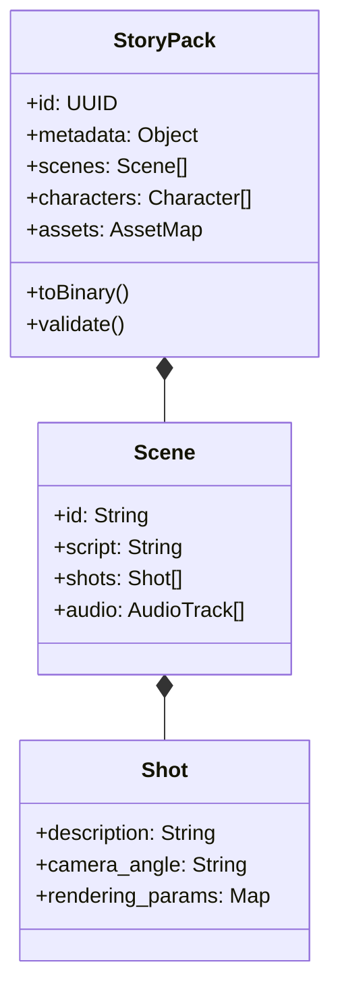

# 10. StoryPack データフロー：Moyin のユニバーサル言語（StoryPack Data Flow）

## @Overview

こんにちは、AKIRA です。
今回は Moyin プロジェクト全体を貫く「血液」とも言える、`StoryPack` データ構造とそのフローを解説します。

ソフトウェアアーキテクチャで最も重要な意思決定の一つは「**コンポーネント間で何を渡すか**」です。Moyin では、Director Agent・Drama Workshop・MCP Server・TTS Worker・ComfyUI Worker・映像合成まで、すべてのコンポーネントが `StoryPack` という共通フォーマットで会話します。

---

## 📦 StoryPack クラス図

`StoryPack` は Moyin 全体で使用される汎用データキャリアで、創作から描画までの一貫した接続を確保します。



---

## 🔍 各フィールドの詳細解説

### 🏷 StoryPack（ルートオブジェクト）

| フィールド   | 型          | 役割                                             |
| ------------ | ----------- | ------------------------------------------------ |
| `id`         | UUID        | 全制作ジョブを一意に識別するキー                 |
| `metadata`   | Object      | 作品タイトル・バージョン・作者情報・制作設定など |
| `scenes`     | Scene[]     | すべてのシーンの配列（順序付き）                 |
| `characters` | Character[] | 登場キャラクターとそのモデル参照                 |
| `assets`     | AssetMap    | 生成済み音声・映像・画像ファイルのパスマップ     |
| `toBinary()` | Method      | バイナリシリアライズ（高速転送用）               |
| `validate()` | Method      | データ整合性チェック（Worker 受け取り前の検証）  |

### 🎬 Scene（シーンオブジェクト）

一つの連続した場面を表現する単位です：

| フィールド | 型           | 役割                                          |
| ---------- | ------------ | --------------------------------------------- |
| `id`       | String       | シーン識別子（`scene_01`など）                |
| `script`   | String       | このシーンの台詞・ナレーションテキスト        |
| `shots`    | Shot[]       | このシーンを構成するカメラショット群          |
| `audio`    | AudioTrack[] | 音声トラック（BGM・効果音・キャラクター音声） |

### 🎥 Shot（ショットオブジェクト）

映像制作における最小単位——一つのカメラアングルと構図：

| フィールド         | 型     | 役割                                                    |
| ------------------ | ------ | ------------------------------------------------------- |
| `description`      | String | 自然言語でのショット内容説明                            |
| `camera_angle`     | String | カメラアングル（`close_up`・`wide`・`over_shoulder`等） |
| `rendering_params` | Map    | ComfyUI へ渡すレンダリングパラメータ集                  |

---

## 🔄 データフロー 4 フェーズ

```
Phase 1: Creation
moyin-web → Director Agent
└── StoryPack v1（基本構造のみ）を生成

Phase 2: Enhancement
v1 → Director Agent / Drama Workshop
└── StoryPack v2（分鏡・感情・カメラワーク追加）

Phase 3: Distribution
v2 → MCP Server → Workers
└── シーン単位で分割して各 Worker へ配布

Phase 4: Reporting
Workers → MCP Server
└── 完成した音声/映像URLを StoryPack に書き戻し
```

### ① Creation Phase（創作フェーズ）

`moyin-web` がユーザーの入力から初期 StoryPack を構築。この段階では基本的な場面構成と台詞のみが含まれます。

### ② Enhancement Phase（拡充フェーズ）

`Director Agent` がシーンを分析し、分鏡・感情ラベル・カメラワーク指示を追加。Drama Workshop でユーザーが手動調整も可能。

### ③ Distribution Phase（配布フェーズ）

`MCP Server` が StoryPack をシーン単位で分割し、適切な Worker キューへ配布：

- テキストスクリプト → TTS Worker
- ショット記述 → ComfyUI Worker
- 両方完了後 → Video Render Worker

### ④ Reporting Phase（報告フェーズ）

各 Worker が処理完了後、生成した音声・映像ファイルの URL を StoryPack の `assets` フィールドに書き戻し。最終的に StoryPack は「完全な制作成果物の地図」になります。

---

## 💡 なぜ StoryPack という共通フォーマットが重要なのか？

**インターフェース契約（Interface Contract）の実現**：TTS Worker は「StoryPack を受け取り、StoryPack を返す」ことだけを知っていればよい。ComfyUI Worker も同様です。コンポーネント間の結合を最小化し、部品の差し替え（別の TTS エンジンへの移行など）を容易にします。

**一貫したバリデーション**：`validate()` メソッドが全コンポーネントで共通のデータ整合性チェックを提供。「あのシーンのショットが欠けている」「音声トラックの timecode が発散している」といったバグを制作開始前に検出します。

**完全な監査トレイル（Audit Trail）**：StoryPack の各バージョンを MongoDB に保存することで、制作過程の全ステップが記録されます。問題発生時に「どの Worker がどのタイミングで何を変更したか」を完全に追跡可能です。

---

👉 **[戻る: Moyin Group 概要](./00.Moyin_Group_Overview.md)**
