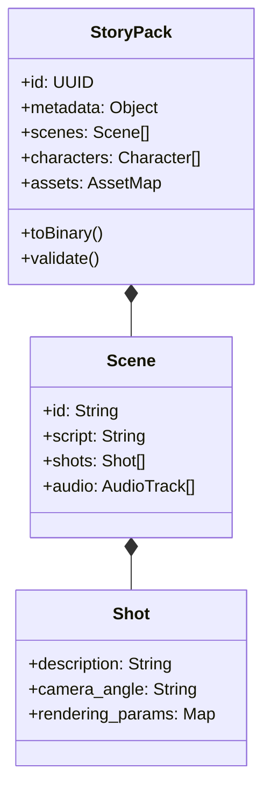

# StoryPack データ構造とライフサイクル (StoryPack Data Flow)

## @Overview

`StoryPack` は Moyin プロジェクト全体の共通データキャリアであり、創作からレンダリング、そして最終出力に至るまでのデータの一貫性を保証する中核的なデータ交換フォーマットです。

---

## 📦 StoryPack 交換フォーマット標準

---

## 🔄 データ転送とフェーズ (Data Lifecycle)

1.  **Creation Phase (創作フェーズ)**:
    `moyin-web` 上で、ユーザーまたは AI が初期シナリオと基本構成を生成します。
2.  **Enhancement Phase (拡張フェーズ)**:
    `Director Agent` が `StoryPack` を解析し、精細な絵コンテやカメラアングル、レンダリングパラメータを付与します。
3.  **Distribution Phase (配信フェーズ)**:
    `MCP Server` が `StoryPack` をタスクごとに分割・パッケージングし、最適な Worker エージェントへ配送します。
4.  **Reporting Phase (レポートフェーズ)**:
    各 Worker が生成を完了すると、`StoryPack` 内のアセットパス（例: `video_url`, `audio_path`）を更新し、全体の生成結果を統合します。

---

👉 **[知識ベースのトップへ戻る](../../HOME.md)**
