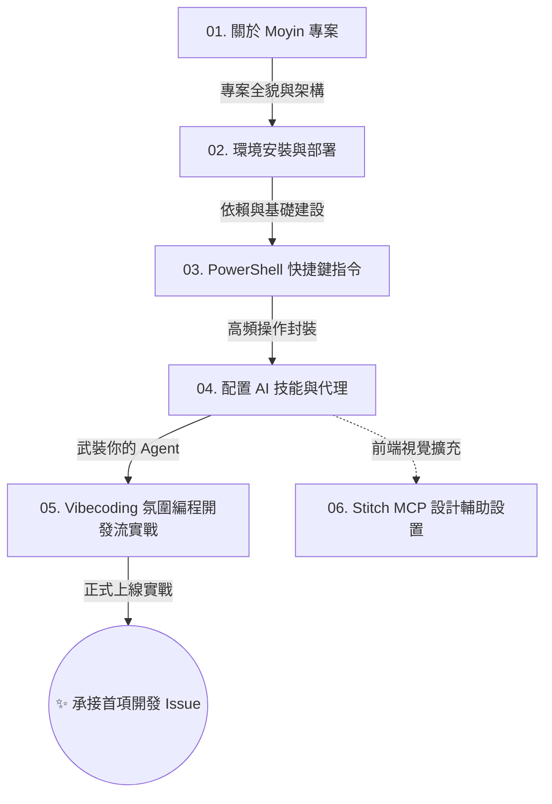

# Moyin 新手迎新基地 (Onboarding Guide)

## @概覽

歡迎來到 Moyin 專案開發基地！本指南專為新進開發戰友設計，旨在幫助您從上帝視角快速切入，掌握從系統架構到終端機操作的核心技法。我們將共同建立一套流暢且高效的「**AI 氛圍編程 (Vibecoding)**」開發節奏，實現人機協作的最優解。

---

## 🗺️ 學習路徑地圖 (Learning Map)

為確保吸收效率，強烈建議您依照下圖順序，循序漸進地擊破各個知識模組：

---

## 📂 核心引導目錄

### 第一階段：破冰入門與基建 (Getting Started)

此階段的目標只有一個：將您的本地電腦打造成開箱即用、隨時可讓 AI 進駐接管的「戰鬥環境」。

1.  **[01. 關於 Moyin 專案](./01_welcome_to_moyin.md)**
    - 搞懂 Moyin 的業務核心、微服務邊界，以及 `workspace/knowledge` 知識庫作為「外部大腦」的絕對重要性。
2.  **[02. 環境安裝與部署](./02_environment_setup.md)**
    - 動手建構地基。安裝 `Node.js`, `Python`, `pnpm` 與 `uv` 等高性能 Runtime 工具。
3.  **[03. PowerShell 快捷鍵指引](./03_powershell_alias_cheat_sheet.md)**
    - 透過 Alias 設定消除重複性勞動，將冗長的日常指令縮短為一瞬閃現的快捷鍵。
4.  **[04. 配置 AI 技能與代理](./04_skills_and_agents.md)**
    - 深入 `.agent` 目錄，學習為 AI 裝備「技能包」並接通「MCP 介面」，讓它從對話框進化為全能工程師。
5.  **[05. Vibecoding 氛圍編程開發流實戰](./05_vibecoding_workflow.md)**
    - **本指南的重中之重**。掌握「下令提案 → 點頭批准 → 苦力執行 → 冷眼驗收」的人機協作標準 SOP。
6.  **[06. Google Stitch MCP 設置指南 (Optional)](./06_stitch_mcp_setup.md)**
    - 選修課程。配置 Google Cloud 高階視覺外掛，讓您的 AI 獲得「看圖即生成代碼」的超能。

---

## 💡 架構師的結語

當您完成這六個基礎關卡後，恭喜您，您已具備成為一名合格「Moyin 專案 AI 領航員」的入線資格。

在 Vibecoding 的範式下，您不需要辛苦地逐行撰寫程式碼。請善用版本控制作為安全網，並帶著本指南教您的策略心法，果斷向 AI 下達您的第一項開發指令吧！下個世代的開發旅程，就此展開。

---

👉 **[下一篇：01. 關於 Moyin 專案](./01_welcome_to_moyin.md)**
