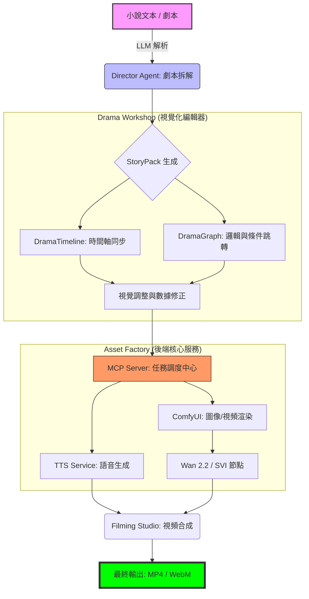

# AI 漫劇生產全流程架構 (Drama Production Workflow)

## @概覽

本流程圖展示了從原始的「小說文本/劇本」到「最終視訊成果」的端對端自動化生產路徑，由 AI 代理人與後端服務共同驅動。

---

## 🎭 漫劇生產全流程圖

---

## 🛠 關鍵技術節點說明

1.  **Director Agent**：
    負責將非結構化的自然語言轉化為結構化的 `StoryPack` (JSON 格式) 規格。
2.  **Drama Workshop**：
    - `DramaTimeline`：處理音效、語音、鏡頭語言的精確同步控制。
    - `DramaGraphEditor`：基於 VueFlow，允許開發者編輯非線性的劇本結構與邏輯跳轉。
3.  **Task Queue (任務佇列管理)**：
    - **Default Queue**：處理輕量級的 TTS 與數據格式轉換（CPU 密集型任務）。
    - **GPU Queue**：專供 ComfyUI 影像生成、渲染與視頻終期合成（VRAM 密集型任務）。

---

👉 **[下一篇：MCP 伺服器架構解析](./08.Moyin_MCP_Architecture.md)**
