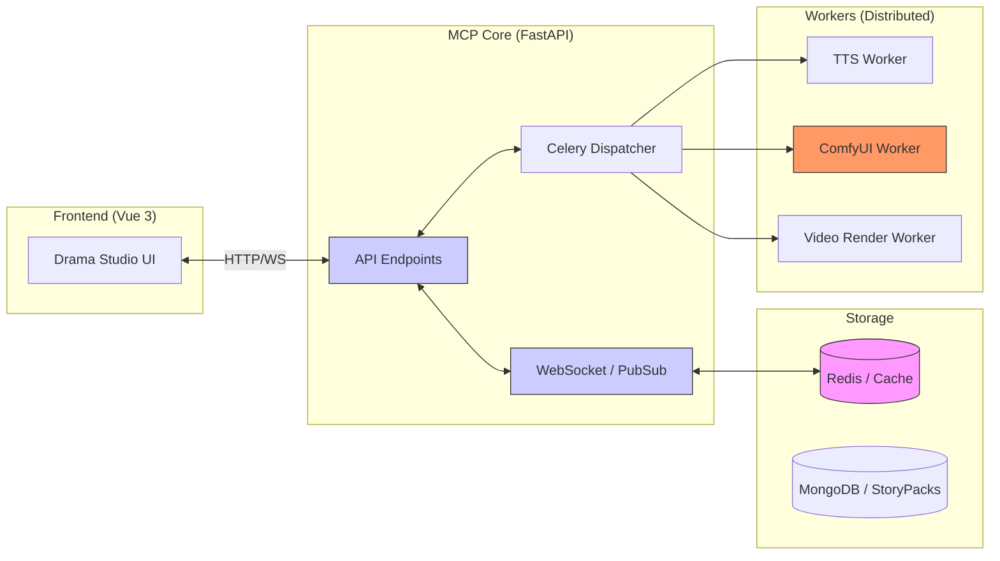

# MCP 伺服器系統架構分析 (MCP Architecture)

## @概覽

`moyin-mcp-server` 是專案的核心任務調度中樞，負責串聯前端 UI 與後端各類高性能渲染服務（如 TTS、ComfyUI 與視頻合成引擎）。

---

## 🏛 MCP Server 架構圖 (Architectural Diagram)

---

## 📡 通訊協議與資料流動

1.  **Command Channel (控制通道)**：
    用於發送生產與渲染指令（例如 `start_render`）。
2.  **Status Sync (狀態同步)**：
    基於 Redis PubSub 的實時狀態同步機制，前端 UI 會主動監聽後端任務的執行進度並即時更新。
3.  **Data Sync (資料同步)**：
    全系統統一使用 `StoryPack` 作為節點間的數據交換格式，確保分散式架構下的資料一致性。

---

👉 **[下一篇：Model Studio 整合流程圖](./09.Model_Studio_Integration.md)**
