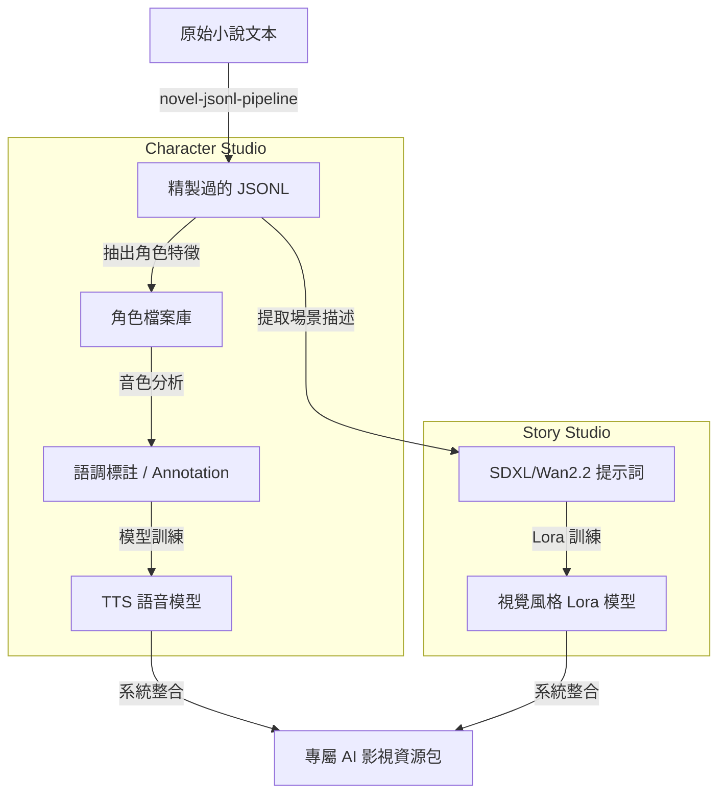

# Model Studio 整合：機器學習流水線與數據產出 (Model Studio Integration)

## @概覽

詳細展示 `moyin-model-studio` 如何整合小說文本處理流水線，實現角色音色與視覺形象的自動化訓練與產出。

---

## 🧠 模型訓練與數據生成流程

---

## 🎯 整合與自動化目標

1.  **Low-Code Interface**：採用 VueFlow (Vue 3) 重構訓練流水線，提供視覺化且易於調整的操作界面。
2.  **Dataset Automation**：實現自動化數據預處理，將長篇小說文本精準轉化為可用於 AI 訓練的高質量數據集。
3.  **Cross-Model Alignment**：確保在最終生產階段，同一角色的視覺 Lora 形象與其 TTS 音色能達到高度的對齊與同步。

---

👉 **[下一篇：StoryPack 數據生命週期](./10.StoryPack_Data_Flow.md)**
