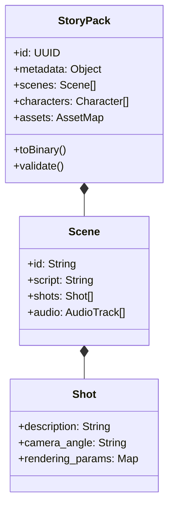

# StoryPack 資料架構與生命週期 (StoryPack Data Flow)

## @概覽

`StoryPack` 是 Moyin 全系統通用的數據載體，作為核心的數據交換格式，它確保了從最初的創意發想到最終影像渲染的一致性與完整性。

---

## 📦 StoryPack 交換格式標準

---

## 🔄 數據流轉流程 (Data Lifecycle)

1.  **創作階段 (Creation Phase)**：
    由 `moyin-web` 或 AI 代理人生成初始的小說劇本與基礎場景結構。
2.  **增強階段 (Enhancement Phase)**：
    `Director Agent` 介入分析 `StoryPack`，豐富其中的分鏡細節、鏡頭角度與渲染參數。
3.  **分發階段 (Distribution Phase)**：
    `MCP Server` 將 `StoryPack` 拆分並封裝為獨立任務，發送給不同的分散式 Worker 節點執行。
4.  **回報階段 (Reporting Phase)**：
    Worker 完成生產後，更新 `StoryPack` 中的產出物儲存路徑（如 `video_url`），最終整合為完整的影視作品。

---

👉 **[返回知識庫首頁](../../HOME.md)**
